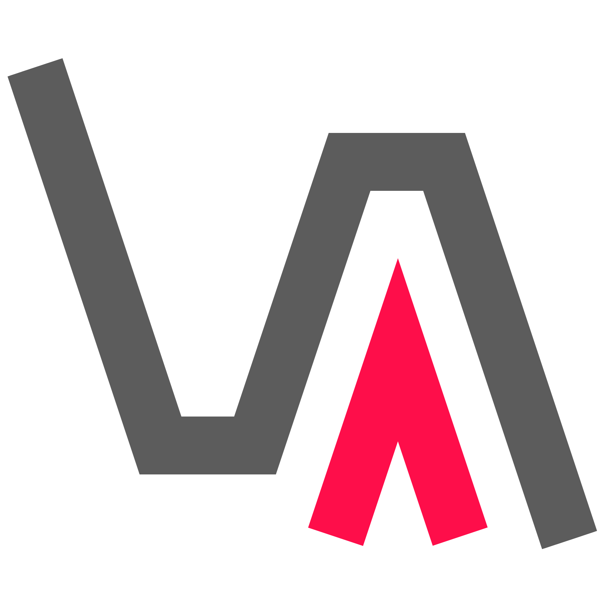

## Description

Vulas supports software development organizations in regards to the secure use of open-source components during application development. It is a collection of client-side scan tools, RESTful microservices and rich [OpenUI5](https://openui5.hana.ondemand.com/) Web frontends.

Vulas analyzes **Java** and **Python** applications in order to
- detect whether they depend on open-source components with known vulnerabilities,
- collect evidence regarding the execution of vulnerable code in a given application context (through the combination of static and dynamic analysis techniques), and
- support developers in the mitigation of such dependencies.

As such, it addresses the OWASP Top 10 security risk A9, [Using Components with Known Vulnerabilities](https://www.owasp.org/index.php/Top_10-2017_A9-Using_Components_with_Known_Vulnerabilities), which is often the root cause of data breaches [[1]](https://snyk.io/blog/owasp-top-10-breaches/).

In comparison to other tools, the detection is code-centric and usage-based, which allows for more accurate detection and assessment than tools relying on meta-data. The approach implemented in Vulas is best described in the following scientific papers:
- Serena Ponta, Henrik Plate, Antonino Sabetta, [Beyond Metadata: Code-centric and Usage-based Analysis of Known Vulnerabilities in Open-source Software](https://arxiv.org/abs/1806.05893), 34th International Conference on Software Maintenance and Evolution (ICSME), 2018
- Henrik Plate, Serena Ponta, Antonino Sabetta, [Impact Assessment for Vulnerabilities in Open-Source Software Libraries](https://arxiv.org/pdf/1504.04971.pdf), 31st International Conference on Software Maintenance and Evolution (ICSME), 2015

## Requirements

Vulas is a collection of client-side scan tools, RESTful microservices and rich [OpenUI5](https://openui5.hana.ondemand.com/) Web frontends.

Before being able to actually scan applications using the client-side tools, one has to:
1. Clone the repository, and build the various binaries using `mvn clean install`
2. Deploy the two microservices (`rest-backend` and `rest-lib-utils`)
3. Deploy the two Web frontends (`frontend-apps` and `frontend-bugs`)
4. Add vulnerabilities to the Vulas knowledge base (using the `patch-analyzer`, which analyzes the commits fixing given vulnerabilities in open-source components, and the `patch-lib-analyzer`, which checks whether libraries are affected by vulnerabilities)

The above requires a considerable amount of effort, which makes it difficult for organizations to get going with Vulas.

To foster the adoption of Vulas, we plan to release the following other artifacts in dedicated repositories, both planned for Q4 2018:
- Steps 2 and 3 will be facilitated by the release of Docker files and Docker Compose files
- Step 4 will be facilitated by the release of the existing knowledge base comprising 700+ vulnerabilities in Q4 2018. 

<!--

## Download and Installation

## Configuration

## Limitations

As of today, the static and dynamic analysis is only available for Java applications.

## Known Issues

-->

## How to obtain support

We will create a dedicated tag on [Stack Overflow](https://stackoverflow.com) to facilitate the support of and discussion among Vulas users.

## Contributing

You want to contribute? Here are the options:
 * Help Others on Stack Overflow
 * Report bugs as GitHub issues 
 * Analyze GitHub issues
 * [Report an Issue](CONTRIBUTING.md#report-an-issue)
 * [Contribute Code](CONTRIBUTING.md#contribute-code)
 * [Contribute to the Vulnerability Knowledge Base](CONTRIBUTING.md#knowledge-base)

<!--

## To-Do (upcoming changes)
The following is a subset of pending feature requests:
- Static and dynamic analysis for Python
- Support of JavaScript (client- and server-side)
- UI dashboards for workspaces

-->

## License
Copyright (c) 2018 SAP SE or an SAP affiliate company. All rights reserved.
This project is licensed under the Apache Software License, v. 2 except as noted otherwise in the [LICENSE file](LICENSE.txt).

## References
[1] https://snyk.io/blog/owasp-top-10-breaches/
