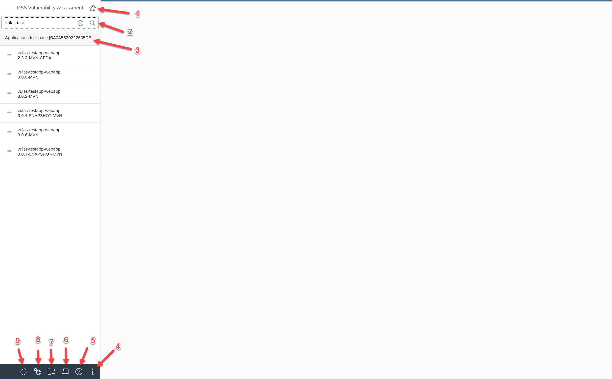
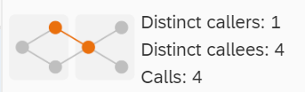
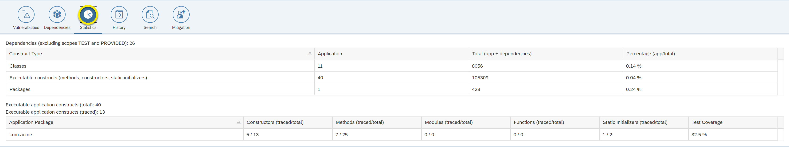
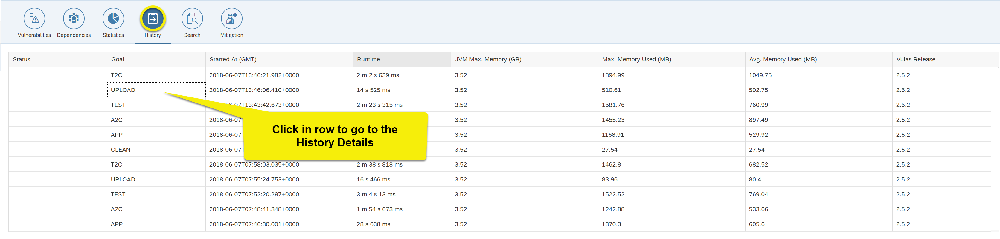
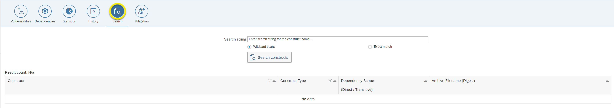
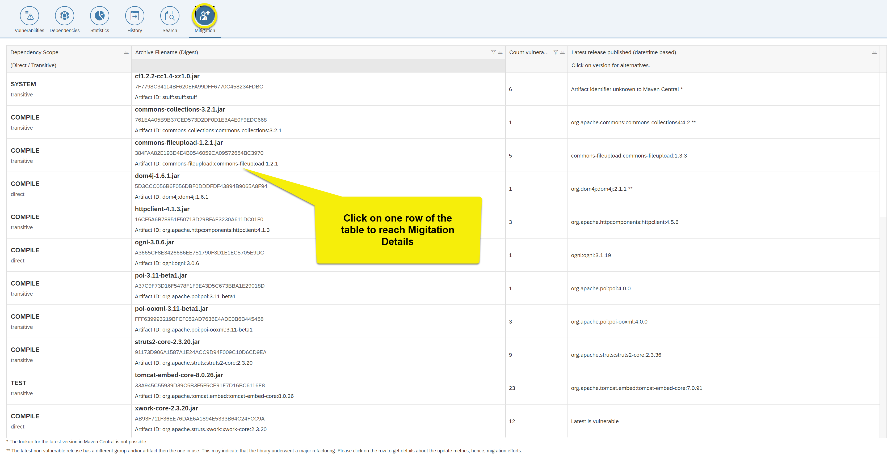

# Frontend Manual

This guide describe the different views of the apps Web frontend. The sections describing each view can be reached by following the `?` icon in the top-right corner of the  frontend view itself.

## Start page

The start page is displayed when opening the URL of the @@PROJECT_NAME@@ Web Frontend (usually following a link looking like @@ADDRESS@@/apps) in the browser:

<center class='expandable'>
    [](./img/frontend_start_page.png)
</center>


The table displayed on the left contains a subset of the applications analyzed by @@PROJECT_NAME@@. Each application is identified by a triple (group, artifact, version), but only artifact and version are shown in the table.

When selecting an application, the analysis results will be displayed on the right.

In case your application is not shown, use the search field on top of the table. It can be used for filtering all applications whose group, artifact or version match the provided search string.

Other UI controls highlighted in the screenshot are as follows:

|   | Control            | Description |
|---|---                 |---          |
| 1 | Home               | Reloads the entire application, no application will be shown on the right |
| 2 | Redo Search        | Re-applies the search criterion |
| 3 | Workspace          | Identifier of the current workspace |
| 4 | About              |Provides information about the application such as version, authors, etc. |
| 5 | Help               | Opens this Wiki page |
| 6 | Documentation      | Provides a link to the Documentation |
| 7 | Workspace Creation | Tools to create a new workspace |
| 8 | Settings           | Provides the possibility to connect to another backend for loading application analyses (expert user only) and to select a workspace to display |
| 9 | Reload             | Reloads all the applications (use if you want to see the analysis results of an application that did not exist before) |

## Vulnerabilities

**Objective of view:** Provide an overview about vulnerable Open-Source dependencies of an application, together with the information whether vulnerable code of such dependencies (e.g. methods) are potentially or actually executable in the context of the application.


<center class='expandable'>
[](./img/frontend_vulnerabilities.png)
</center>

UI controls highlighted in the screenshot are as follows:

|  |  |  |
|---|---|---|
| 1 | Reset table | Removes filters and groups from the table |
| 2 | Reload data | Reloads the app-specific analysis results from the database (use if you executed [@@PROJECT_NAME@@ goals](../analysis/#overview) and want to see its analysis results in the frontend). |
| 3 | Toggle historical vulnerabilities | Shows and hides the display of historical vulnerabilities, e.g., vulnerabilities that existed in a previous version of the archive. <p>Note: Historical vulnerabilities do not require any action as they do not represent a threat to application security.<p>Note: This option is taken into account after pressing the "Reload Data" button (see 2) |
| 4 | Toggle unconfirmed vulnerabilities | Shows and hides the display of unconfirmed vulnerabilities, i.e. vulnerabilities which have not yet been confirmed by @@PROJECT_NAME@@.<p>Note: This option is taken into account after pressing the "Reload Data" button (see 2) |
| 5 | Help | Link to the frontend vulnerabilities help page (e.g. this page) |
| 6 | Reload application data |  |

**Objective of table:** same as objective of view

**Data shown:** Each row corresponds to a vulnerability in a dependency, e.g., multiple vulnerabilities in the same dependency appear in separate table rows. The three columns to the right show whether vulnerable code is included, whether it is potentially reachable or if it was actually reached (executed) at application runtime. Click on a row in order to open the [vulnerability details view](#vulnerabilities-details)

**Data collected by goal(s):** vulas:app (to populate the table rows), vulas:a2c and vulas:t2c to populate the column 'Static Analysis', JUnit and Integration tests to populate the column 'Dynamic Analysis'

**Empty if:** An application has no vulnerable dependencies or no dependencies at all

| Column | Description |
|---|---|
| Dependency Scope <p>(Direct / Transitive) | When using the @@PROJECT_NAME@@ Maven plugin, the scope corresponds to the Maven scope (see [here](https://maven.apache.org/guides/introduction/introduction-to-dependency-mechanism.html#Dependency_Scope) for more information). Dependencies that are declared in the application's POM appear as 'direct' dependency, all others appear as "transitive".<p>When using the @@PROJECT_NAME@@ CLI, the scope is always 'Runtime' and the dependency always appears as 'direct', since the CLI cannot derive this information from the JARs found in the file system. |
| Archive Filename <br>(SHA1) | The filename of the library as found in the file system on which the analysis was run. <br>The SHA1 is the unique identifier of libraries. It can happen that an application has multiple dependencies with the same filename but different SHA1. |
| Vulnerability | The identifier of the vulnerability, typically a CVE identifier as used in the NVD. The CVSS score is shown for all vulnerabilities present in the NVD (note that only CVSS v2 is supported), `n/a` for all others. |
| Inclusion of vulnerable Code |  Indicates whether the dependency contains vulnerable code. <p><p><p>   The library version is confirmed to contain vulnerable code <p><p><p>   The library version is confirmed to contain fixed code (a so-called "historical vulnerability") <p><p><p>   It is unknown whether the library version contains the vulnerable or the fixed code. <br> Note: The @@PROJECT_NAME@@ admin team will be automatically notified about such cases in order to take a decision |
| Static Analysis: Potential execution of vulnerable code | Indicates whether vulnerable code (e.g., methods) are potentially reachable (executable) according to the results of the static source code analysis (performed during vulas:a2c and vulas:t2c).<p><p><p>  Vulnerable code is potentially reachable, i.e., the application can be executed in such a way that the vulnerable code is reached. <br> Note: In few cases, the vulnerable code of a given bug is not known. In those cases, this icon appears as soon as any code of the library is found reachable. <p><p><p>  Library code is reachable, i.e., part of the call graph, but none of the vulnerable code. <p><p><p>  No library reachable or reachability analysis not performed |
| Dynamic Analysis: Actual execution of vulnerable Code |  Vulnerable code is executed <br>Note: In few cases, the vulnerable code of a given bug is not known. In those cases, this icon appears as soon as any code of the library is executed.<p><p><p>  Library code is executed, but none of the vulnerable code <p><p><p>  No library code executed or no tests have been performed |

## Vulnerabilities Details

**Objective of Page:** Provide detailed information about the vulnerability, the source code repository of the Open-Source project and the constructs (e.g., methods) that have been touched by the Open-Source developers in order to fix the vulnerability.

<center class='expandable'>
[](./img/frontend_vulnerabilities_details.png)
</center>

UI controls highlighted in the screenshot are as follows:

| | Control | Description |
|---|---|---|
| 1 | Help | Link to the documentation page for Vulnerabilities Details (e.g. this page) |
| 2 | Exploit database | Opens the search page of the <a href="https://www.exploit-db.com/">Exploit Database</a> in a new browser window, in order to let you search for exploits for the given vulnerability . <p>Note: You need to manually complete the Captcha in order to start the search. |
| 3 | NVD (National Vulnerability Database) | Opens a link with more vulnerability information in a new browser window. In most of the cases, it is a page from the<a href="https://nvd.nist.gov/">NVD.</a> |
| 4 | Google Trends | Shows whether the given vulnerability was a popular Google search term (thus, received a lot of public interest) over the course of the last 30 days (click to see other time ranges). |

**Objective of table:** Provide information whether individual vulnerable constructs (methods or constructors) are contained in the respective library, and whether they are potentially or actually reachable.

**Data shown:** All constructs (methods or constructors) that have been added, modified or deleted by the developers of the Open-Source library in order to fix the respective vulnerability.

**Data collected by goal(s):** Table rows are taken from the bug database, which is maintained by the @@PROJECT_NAME@@ admin team. The three columns to the right are populated by vulas:app (column 'Contained'), vulas:a2c and vulas:t2c (column 'Reachable'), as well as through the execution of tests (column 'Traced')

**Empty if:** Vulnerabilities that have no known fix or whose fix concerns non-Java files, e.g., XML configuration files. The two right-most columns are empty if the goals vulas:a2c or vulas:t2c have not been executed, or if no tests have been performed

| Column | Description |
|---|---|
| Change | Indicates whether the given construct has been ADDed, MODified or DELeted as part of the respective commit (revision) |
| Revision | Commit identifier |
| Type | Class or Constructor |
| Qualified construct Name (Path) | The fully qualified name of the construct, i.e., including package name, class name(s) and parameter types<p> Example: `com.acme.Foo$Bar.go(String)`, whereby com.acme is a package, Foo and Bar classes and go(String) a method name including a String parameter |
| Contained | Indicates whether the respective construct is part of the Java archive or not<p>Note: Very often, the commits of the Open-Source developers also contain changes to their JUnit test classes. Those classes are typically not contained in the released Java archive |
| Reachable | Indicates whether the respective construct is part of the call graph built during the @@PROJECT_NAME@@ goals a2c and t2c<p>Click on the icon in order to see the actual [call graph leading to the respective vulnerable code](#vulnerable-code-call-graph)<p><p>  It is part of the call graph<p><p>  It is not part of the call graph (but others constructs of the archive are)<p><p>  No construct of the respective archive is part of the call graph |
| Traced | Indicates whether the respective construct has been executed during JUnit or integration tests<p>Click on the icon in order to see the actual [call graph leading to the respective vulnerable code](#vulnerable-code-call-graph)<p><p>  It has been executed. In this case, the tooltip contains information about the timestamp of the execution, the number of calls and the goal identifier<p><p>  It has not been executed (but others constructs of the archive have been)<p><p>  No construct of the respective archive has been executed |

## Vulnerable Code Call Graph

**Objective of graph:**

Provide information on paths leading to vulnerable methods


**Data shown:** The vulnerable methods are shown as red nodes, while methods part of the application are shown as green nodes. Black edges result from the static source code analysis, while red edges have been collected during test execution.<span>The fully qualified name of methods and constructors as well as archive information is shown when hovering over nodes.</span>

**Data collected by goal(s):** a2c and t2c (black edges), JUnit and integration tests (red edges)

**Empty if:** No paths to vulnerable methods were found


<center class='expandable'>
[](./img/frontend_vulnerabilities_graph.png)
</center>

UI controls highlighted in the screenshot are as follows:

| | Control | Description |
|---|---|---|
| 1 | Collapse graph on library level | Collapses all nodes representing methods of the same library into one node. |
| 2 | Collapse graph on package level | Collapses all nodes representing methods of the same package into one node. |
| 3 | Collapse graph on class level | Collapses all nodes representing methods of the same class into one node. |
| 4 | Expand all | Shows the original graph. |
| 5 | Collapse nodes | Collapses all nodes |
| 6 | Help/Documentation | Opens the documentation to this page |
| 7 | NVD (National vulnerability Database) | Opens the <a href="https://nvd.nist.gov/">NVD </a>for the respective vulnerability in a new browser window. |

## Dependencies

**Objective of view:** Provide an overview about all dependencies of the application, no matter whether they contain vulnerabilities or not</p>

<center class=expandable>
[](./img/frontend_dependencies_overview.png)
</center>

**Objective of table:** Same as objective of view

**Data shown:** All dependencies of the application. Click on a dependency's filename in order to open the [dependencies details view](#dependencies-details)

**Data collected by goal(s):** vulas:app and test

**Empty if:** An application has no dependencies at all

The content of the table can be detailed as follow:

| Details | Description |
|---|---|
| Archive Filename <p>(SHA1) | The filename of the library as found in the file system on which the analysis was run.<p>The SHA1 is the unique identifier of libraries. It can happen that an application has multiple dependencies with the same filename but different SHA1. |
| Dependency Scope | When using the @@PROJECT_NAME@@ Maven plugin, the scope corresponds to the Maven scope (see here for more information).<p>When using the @@PROJECT_NAME@@ CLI, the scope is always 'Runtime'. |
| Direct / Transitive | Direct dependencies are declared/required by the application itself, e.g., because the application makes use of a dependency's API.<p>Transitive dependencies are declared/required not by the application but by its dependencies, e.g., because a dependency makes use of another dependency's API.<p>When using the @@PROJECT_NAME@@ Maven plugin, dependencies that are declared in the application's POM appear as 'direct' dependency, all others appear as 'transitive'.<p>When using the @@PROJECT_NAME@@ CLI, the dependency always appears as 'direct', since the CLI cannot derive this information from the JARs found in the file system. |
| SHA1 known to Maven Central | <span style="color: rgb(36, 203, 120);"><strong>true</strong></span> if the SHA1 of the JAR is known to <a href="http://search.maven.org/">Maven Central</a>, <span style="color: rgb(255,0,0);"><strong>false</strong></span> if not. |
| Dependency declared in POM | <span style="color: rgb(36, 203, 120);"><strong>true</strong></span> if the dependency information was read from the application's POM file using the @@PROJECT_NAME@@ Maven plugin, <span style="color: rgb(255,0,0);"><strong>false</strong></span> if not. |
| Library constructs <p>potentially executable | Number of library constructs potentially reachable (executable), according to the results of the static source code analysis (@@PROJECT_NAME@@ goals a2c and t2c). || Library constructs <p>actually executed | Number of library constructs actually executed during JUnit or integration tests |

This screen provides several additional controls:

| | Control | Description |
|---|---|---|
| 1 | Help/Documentation | Opens the documentation to this page |
| 2 | Reload App Data | Reloads the content of the page |

The following information are displayed on the top of the main table:

| Name | Description |
|---|---|
| Archives Total | The total number of archives/files which are dependencies of the application. |
| Archives Traced | The number of archives which were traced during the execution of the `test` goal |
| Total Number of Traces | The total number of traces which were generated during the execution of the `test` goal |

## Dependencies Details

**Objective of Page:** Provide detailed information about a given dependency, including information about the application-specific use and update possibilities.

<center class='expandable'>
[](./img/frontend_dependencies_details.png)
</center>

UI controls highlighted in the screenshot are as follows:

|  | Control | Description |
|---|---|---|
| 1 | Maven Central | Shows all versions of the given artifact in <a href="http://search.maven.org/">Maven Central</a><p>Example: If the dependency shown is (commons-collections, commons-collections, 3.2.1), all versions of (commons-collections, commons-collections) known to Maven Central will be shown. |
| 2 | Help/Documentation | Opens the documentation to this page |

At the top of the view, the following information are provided:

| Name | Description |
|---|---|
| Digest | The unique id of the library (for example its SHA1) |
| Digest verified | <span style="color: rgb(36, 203, 120);"><strong>true</strong></span> if the library id could be verified against the library repository, <span style="color: rgb(255,0,0);"><strong>false</strong></span> if not. |
| Dependency Path | The path to the dependency. |

The view contains the following four section:

* [Calls from application to Archive](#calls-from-application-to-archive)
* [Library size and application-specific use](#library-size-and-application-specific-use)
* [Finding non-vulnerable library versions](#finding-non-vulnerable-library-versions)
* [Archive Properties](#archive-properties)

### Calls from application to Archive

This section shows direct call interactions between an application and the dependency (independent of any vulnerabilities). This information is useful when deciding about the update of a dependency, e.g., to a more recent version.

It is divided into two parts. On the top, a picture presents an overview of these interactions:

<center class='expandable'>
[](./img/frontend_dependencies_details_2.png)
</center>

| Name | Description |
|---|---|
| Distinct callers | The number of distinct constructs in the application which are calling constructs of the library. |
| Distinct callees |The number of distinct constructs of the library which are called by constructs of the application. |
| Calls | The number of calls from the application to the library |

Below this picture, details of these interactions are described in a table.

**Objective of Table::** Shows the details of the interactions between an application and the dependency.

**Data shown::** Calls of a library method by an application method or vice versa.

**Data collected by goal(s)::** `vulas:a2c`, `vulas:t2c` and `test`.

**Empty if:** Application and library do not directly interact, e.g., as in case of transitive dependencies. None of the goals have been executed.

| Column | Description |
|---|---|
| Caller | Fully-qualified name of the calling construct. |
| Caller type | **METH**od or **CONS**tructor. |
| Callee | Fully-qualified name the called construct. |
| Potential | True if the call has been found by static source analysis, false otherwise.<p>Note: If the call has not been found by static analyses but has been observed during tests, the false is highlighted in <span style="color: rgb(255,0,0);">red</span>. This can happen if either the static analysis goals `vulas:a2c` and `vulas:2tc` were not executed or the analysis failed to identify the call. |
| Traced | True if the call has been observed during tests, false otherwise. |

### Library size and application-specific use

**Objective of Table:** Show the degree of actual and potential use that the application makes of the dependency (independent of any vulnerabilities).

**Data shown:** The absolute number of constructs contains in the library (methods, constructors, etc.) and the number of constructs potentially or actually executable.

**Data collected by goal(s):** `vulas:a2c`, `vulas:t2c` and `test`.

**Empty if:** The dependency is not at all used in the scope of an application or none of the goals have been executed.

| Column | Description |
|---|---|
| Construct Type | <ul><li>INIT: Static class initializer</li><li>CONS: Constructor</li><li>METH: Method</li><li>CLASS: Class</li><li>ENUM: Enumeration</li><li>PACK: Package</li><li>countExecutable: INIT + CONS + METH</li></ul> |
| Count Total | Absolute number contained in the JAR |
| Count Reachable | Number of constructs found reachable during static source code analysis. |
| Count Traced | Number of observed constructs during tests |

### Finding non-vulnerable library versions

**Objective of Table:** Support the selection of a more recent, non-vulnerable library version.

**Data shown:** All library versions known to Maven Central, together with the number of vulnerabilities known to @@PROJECT_NAME@@. Moreover, the table displays four update metrics computed over the library version currently in use and the respective alternative. Click on a row in order to see details about the removed callees (if any) in the view [Calls from application to archive to be modified](#callers-to-be-modified).

**Data collected by goal(s):**

**Empty if:** Neither the SHA1 nor the Maven identifier (group, artifact, version) of the dependency is known to Maven Central. In this case it is not possible to retrieve alternative versions.

| Column | Description |
|---|---|
| Library Id | The Maven identifier in the format group : artifact : version. |
| Count vulnerabilities | The number of vulnerabilities known by @@PROJECT_NAME@@. |
| Callee stability | The share of library callees that exist with the same signature (cf. table 'Calls from application to archive').<p>Example: If the application directly calls two methods in the current archive and one of those is not any longer present, the callee stability would be '1 out of 2 ( 50% )'.<p>Note: Can be 0 if there are no direct calls between application and library. |
| Dev. effort<p>(calls to modify) | The share of application calls that require a modification due to missing callees (cf. table 'Calls from application to archive').<p>Example: If the application calls a given library method from two of its methods and the library method is no longer present, the development effort would be '2 out of 2 ( 100% )'.<p>Note: Can be 0 if there are no direct calls between application and library</span> (or the respective goals were not run). |
| Reachable body stability | The number of reachable constructs in the current library version that exists as-is, i.e., with identical signature and identical byte code, in the alternative library (cf. table 'Library size and application-specific use').<p>Note: Can be 0 if none of the library constructs is reachable from the application (or the respective goals were not run). |
| Overall body stability | The number of constructs in the current library version that exists as-is, i.e., with identical signature and identical byte code, in the alternative library.<p>Note: This metric is independent of the application-specific use of the library. |

### Archive Properties

**Objective of Table::** Provide meta-information about the dependency, e.g., its version.

**Data shown::** All entries of the Manifest file ('META-INF/MANIFEST.MF' in the JAR).

**Data collected by goal(s)::** `vulas:app`.

**Empty if:** The dependency has no MANIFEST.MF file or it does not contain any entries.

| Column | Description |
|---|---|
| Property Name | The name of the Manifest file entry, e.g., 'Built-By'. |
| Property Value | The value of the Manifest file entry, e.g., 'Foo'. |

## Callers to be modified

**Objective of page:** Support the developer in updating a dependency to a more recent release by showing him all application methods that require modification.

<center class='expandable'>
[](./img/frontend_callers_to_be_modified.png)
</center>

**Data shown:** All application calls that require a modification because of the fact that a callee method is no more available in the selected library version.

**Data collected by goal(s):** `vulas:a2c`, `vulas:t2c` and `tests`

**Empty if:** Either because there exist no direct method invocations from application to library or all of the callee methods still exist in the selected library version.

On the top of the screen some metrics are provided:

| Name | Description |
|---|---|
| Calls to modify | The number of calls to be modified in order to use this library version. |
| Distinct callers to modify | The number of constructors be modified/updated in the application in order to use this library version. |
| Callees deleted | The number of constructs of currently used library (by the application) which no longer exist in this new version of the library. |

These information are followed by a table providing the details:

| Name |  Description |
|---|---|
| Caller | the name of the construct of the application calling the library. |
| Callee type | The type of the called construct in the library. |
| Callee | The name of the called construct in the library. |
| Potential | True if the call has been found by static source analysis, false otherwise.<p>Note: If the call has not been found by static analyses but has been observed during tests, the false is highlighted in <span style="color: rgb(255,0,0);">red</span>. This can happen if either the static analysis goals `vulas:a2c` and `vulas:2tc` were not executed or the analysis failed to identify the call. |
| Traced | True if the call has been observed during tests, false otherwise. |

## Application Statistics

**Objective of page:** Provide an overview about :

* the application and its dependencies,
* the application test coverage.

<center class='expandable'>
[](./img/frontend_statistics.png)
</center>

Two tables are presented in this page:

#### Dependencies

**Objective of table:** Show statistics about the constructs of the application and its dependencies (methods, functions, packages, classes...). Please notice that these information are excluding the dependencies in the scopes `TEST` and `PROVIDED`. In the header of the table user can see the total number of dependencies which were considered.

| Column | Description |
|---|---|
| Construct Type | The Types of analyzed constructs. |
| Application | The number of constructs (of type defined in column "Construct Type") in the application. |
| Total (App + Dependencies) | The total number of constructs (of type defined in column "Construct Type") of all the project, e.g. application code + dependencies |
| Percentage (app/total) | The percentage of code of the application compared to the total code of the project (application + dependencies). |

#### Application

The second section of this page presents 2 metrics and a table:

| Name| Description |
|---|---|
| Executable application constructs (total) | The total number of executable constructs of the application. |
| Executable application constructs (traced) | The number of executable constructs of the application which have been traced. |

**Objective of table:** Same as objective of view.

**Data shown:** The number of traced constructs per application package.

**Data collected by goal(s):** JUnit and integration tests.

**Empty if:** No tests have been run.

| Column | Description |
|---|---|
| Application Packages | Java package of the application. |
| Constructors (traced / total) | <p>Number of constructors of classes in the respective package that were traced during tests.<p>Total number of constructors of classes in the respective package.<p>Note: The application constructs are typically collected from the compiled application code, hence, also comprise default constructors or constructors with <a href="https://docs.oracle.com/javase/tutorial/reflect/member/methodparameterreflection.html#implcit_and_synthetic">synthetic parameters</a> |
| Methods (traced / total) | <p>Number of methods of classes in the respective package that were traced during tests.<p>Total number of methods of classes in the respective package.<p>Note: The application constructs are typically collected from the compiled application code, hence, also comprise synthetic methods such as access methods. |
| Functions (traced/total) | <p>Number of functions in the respective package that were traced during tests.<p>Total number of functions in the respective package.<p>Note: The application constructs are typically collected from the compiled application code, hence, also comprise synthetic functions such as access functions. |
| Static Initializers (traced/total) | <p>Number of static analyzers in the respective package that were traced during tests.<p>Total number of static analyzers in the respective package.<p>Note: The application constructs are typically collected from the compiled application code, hence, also comprise synthetic functions such as access functions. |
| Test Coverage | Percentage of traced constructs (methods, constructors, modules, functions, static initializers). |

## History

**Objective of view:** Provide an overview about goal executions for a given application.

<center class='expandable'>
[](./img/frontend_history_overview.png)
</center>

**Objective of table:** Same as objective of view.

**Data shown:** Each row corresponds to one @@PROJECT_NAME@@ goal execution, click on a row in order to see detailed goal information.

**Data collected by goal(s):** All.

**Empty if:** No goals have been executed.

| Column | Description |
|---|---|
| Status | Empty on success, error message in case of failures |
| Goal | Goal executed, see [here](../analysis) for the list of all goals |
| Started at |Start date and time of the goal execution |
| Runtime | Total duration of the goal execution in minutes |
| JVM Max.Memory (MB) | Max. memory available for the JVM |
| Max. Memory used (MB) | Max. memory used by the JVM |
| AVG. Memory used (MB) | Average memory used by the JVM |
| @@PROJECT_NAME@@ Release | Release of @@PROJECT_NAME@@ used|

By clicking on one item of the list, user will then be able to see the [details of the goal execution](#history-details).

## History Details

**Objective of view:** Provide detailed information about a given @@PROJECT_NAME@@ goal execution, mainly for root cause analysis of problems.

<center class='expandable'>
[](./img/frontend_history_details.png)
</center>

This view presents the following metrics:

| Name | Description |
|---|---|
| Goal Execution ID | Unique ID associated to the goal execution. |
| Started At | The date/time when this goal was executed on the client. |

The view also contains the following three tables:

* Goal statistics
* Goal configuration
* System information


#### Goal statistics

**Data shown:** Statistics collected at goal runtime.

**Data collected by goal(s):** All.

**Empty if:** Should never be empty.

| Column | >Description |
|---|---|
| Property Name | Name of the metric. |
| Property Value |Value of the metric.|

#### Goal configuration

**Data shown:** Configuration settings used for the goal execution.

**Data collected by goal(s):** All.

**Empty if:** Should never be empty.

| Column | Description |
|---|---|
| Property Name | Name of the configuration setting. |
| Property Value |Value of the configuration setting. |


#### System information</p>

**Data shown:** Java system properties and environment variables collected on the client during the goal execution. The configuration settings `vulas.shared.sys` and `vulas.shared.env` determine which information is collected:

```
# Comma-separated list of environment variables gathered during goal execution and transferred to the backend
# A given environment variable is considered if its name equals one of the values (case-insensitive)
#
# Default: 18 variables
vulas.shared.env = PROCESSOR_IDENTIFIER, NUMBER_OF_PROCESSORS, PROCESSOR_LEVEL, PROCESSOR_ARCHITECTURE, PROCESSOR_REVISION, \
                   JAVA_HOME, COMPUTERNAME, \
                   MAVEN_PROJECTBASEDIR, MAVEN_HOME, MAVEN_CONFIG, MAVEN_OPTS, \
                   BUILD_URL, BUILD_TAG, BUILD_TIMESTAMP, BUILD_DISPLAY_NAME, BUILD_ID, BUILD_NUMBER, BUILD_VERSION

# Extension of the above list
# Default: -
#vulas.shared.env.custom

# Comma-separated list of system property namespaces gathered during goal execution and transferred to the backend
# A given system property is considered if it starts with one of those namespaces (case-insensitive)
#
# Default: 6 patterns
vulas.shared.sys = user., os., java., runtime., maven., sun.

# Extension of the above list
# Default: -
#vulas.shared.sys.custom
```

**Data collected by goal(s):** All.

**Empty if:** Should never be empty.

| Column | >Description |
|---|---|
| Property Name | Name of the system/environment setting. |
| Property Value |Value of the system/environment setting.|

## Search

**Objective of view:** Search for constructs in application dependencies.

<center class='expandable'>
[](./img/frontend_search.png)
</center>

**Objective of table:** Same as objective of view.

**Data shown:** Archives that contain one or more constructs (methods, classes, packages, etc.) that match the search expression.

**Data collected by goal(s):** N/a.

**Empty if:** If the search did not yield a result.

## Mitigation

**Objective of view:** Get an overview about vulnerable archives that require a fix.

<center class='expandable'>
[](./img/frontend_mitigation_overview.png)
</center>

**Objective of table:** Same as objective of view.

**Data shown:** Archives that have one or more known vulnerabilities, click on a row in order to see update proposals and metrics in the [dependencies details view](./#dependencies-details).

**Data collected by goal(s):** `vulas:app`.

**Empty if:** An application has no vulnerable dependencies.

| Column | Description |
|---|---|
| Dependency scope<p>(Direct/Transitive) | When using the @@PROJECT_NAME@@ Maven plugin, the scope corresponds to the Maven scope (see here for more information). Dependencies that are declared in the application's POM appear as 'direct' dependency, all others appear as 'transitive'.<p>When using the @@PROJECT_NAME@@ CLI, the scope is always 'Runtime' and the dependency always appears as 'direct', since the CLI cannot derive this information from the JARs found in the file system. |
| Archive Filename<p>(SHA1) | The filename of the library as found in the file system on which the analysis was run.<p>The SHA1 is the unique identifier of libraries. It can happen that an application has multiple dependencies with the same filename but different SHA1. |
| Vulnerability # | Number of known vulnerabilities of a dependency. |
