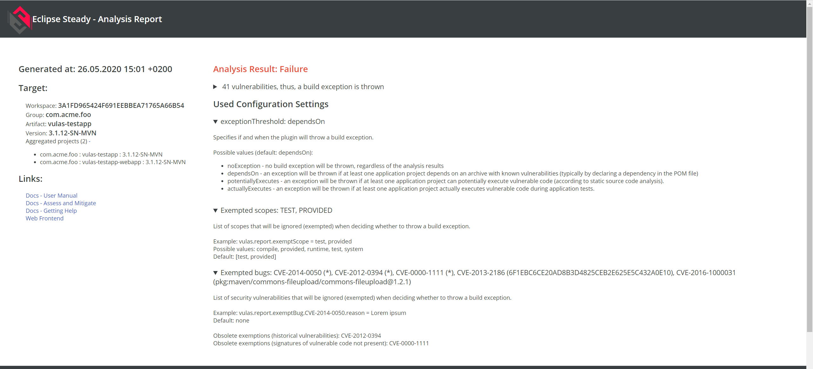

# Report Manual

## Introduction

The reports are generated after the execution of the `report` goal. They are generated in three different formats (JSON, XML and HTML). See the [report goal documentation section](../analysis/#create-result-report-report).

Reports come with the advantage of having an aggregate view on a set of modules. They can mainly be divided into two parts.

## Report Header

The report header contains general information about the scanned  module(s).

    

It provides:

- The date & time the report was created.
- The information if the report is an aggregated report or not.
- The list of projects/modules included in this report.
- The settings used to generate the report (in the "Plugin Configuration" section).
- The conclusion of the exceution of the "report" goal. It is displayed in red when the relevant vulnerabilities were found. Relevant is to be understood as relevant againts the provided settings for the scan, e.g. considering the different settings provided by the user.

## Report Core

The report "core" contains the list of findings. This part is basically was can be seen when opening the Frontend.

Please notice that the "core" section could be empty in case no vulnerability could be identified into the scanned project(s).

    

This list contains the complete list of vulnerabilities identified in the scanned project(s), including assessed and mitigated ones.

- CVEs listed with a red background color and for which the text in the  "Applications including vulnerable code" column is red are vulnerabilities impacting the scanned project(s).
- CVEs with a white background and for which the text in the  "Applications including vulnerable code" column is greyed out are assessed vulnerabilities.