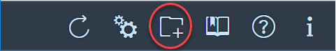

# Setup and Configuration Manual

## Workspace

A workspace acts as a container to group the results of several application analyses. In that context, please note that each module of a multi-module Maven project appears as a separate application in the @@PROJECT_NAME@@ Web frontend.

Before using workspaces, you need to create one using the @@PROJECT_NAME@@ Web frontend (see below); you will obtain a token that you will need to pass as a configuration parameter when performing scans.

### Create workspace(s) (once)

You need to create a workspace once using the @@PROJECT_NAME@@ Web frontend. Use the "create workspace" icon in the lower-left corner toolbar of the apps Web frontend to do so.

<center>

</center>

A workspace has the following properties:

- **Name**: Must be provided. Note that the name is not unique, thus, there can be several workspaces having the same name.
- **Description**: Must be provided.
- **Contact**: Please provide the email address of a distribution list (DL).
- **Export results**:
    - `AGGREGATED`: Findings are aggregated on workspace-level, one item for the entire workspace will be exported
    - `DETAILED`: Findings are aggregated on application-level, one item for every application of the workspace will be exported
    - `OFF`: No export of findings

- **Public**: A public workspace appears in the drop-down box of the apps Web frontend, a private one does not

Once the fields have been filled, press the "Save" button. The system then returns with a pop-up containing the random **token** generated upon workspace creation. Do not forget to note down this token, it will be needed later on for each scan of your application(s).

### Use the generated token (during application analysis)

The workspace token generated at previous step has to be used as value for the configuration setting `vulas.core.space.token`. This information is mandatory during the scans as it allows the user's data to be uploaded to the correct place/workspace in the @@PROJECT_NAME@@ backend. See [here](#configuration) for more information regarding the configuration of @@PROJECT_NAME@@ clients.

### Choose a workspace (in the apps Web frontend)

Use the configuration icon in the lower-left corner in order to select a workspace.

<center></center>

You can search for _public_ workspaces by typing their name in the "Space" field. You can copy&paste the token of a _private_ workspace into the input field in order to select it.

Additional fields "Backend URL" and "Artifact Analyzer URL" can be used to connect the frontend to another backend (than the default running on the same host). Generally, this must not be changed by the users.

Once you have selected a workspace, press "Save" button. The list of applications of that workspace will be automatically loaded on the left list menu of the frontend.

### Edit a workspace (in the apps Web frontend)

In order to edit a workspace, press the same button as to choose a workspace and perform the following steps:

- Enter the name/token id of the workspace to edit in the "Space" field and eventually select one of the entries provided in the drop down list.
- press the "Edit Space" button at the bottom.

Once this button is clicked, all the editable property-fields of the workspace are displayed.

- update/change the data of your workspace as per your expectations.
- Press the "Save" button to save your modifications, press the "close" button to revert your changes.

### Workspace REST API

The REST API can be used to export findings in a machine-readable fashion. Calling HTTP GET on the following URL, for instance, returns all vulnerable dependencies of an aggregated workspace:

`@@ADDRESS@@/backend/hubIntegration/apps/<workspace-name>%20(<workspace-token>)/vulndeps`

The API returns an array of JSON elements having the following data model:

| Property | Description | Possible Values |
|---|---|---|
| projectId | Identifies the affected application and dependency (`<app-GAV> > <dep-filename>`) ||
| type | Identifier of vulnerability in @@PROJECT_NAME@@ knowledge base ||
| scope | Scope of the dependency | see [official Maven documentation](https://maven.apache.org/guides/introduction/introduction-to-dependency-mechanism.html#Dependency_Scope) |
| priority | Priority of the finding | 3 in case of dependencies with scope TEST and PROVIDED, 1 otherwise |
| exemptionReason | Assessment description (if any), see [report goal](../analysis/#create-result-report-report) for more information on how-to assess and exempt findings ||
| state | Assessment result (if any) | 1 (secure-by-design) in case of dependencies with scope TEST and PROVIDED, 4 (mitigated) in case the bug has been exempted, 2 (true-positive) otherwise |
| status | Indicates whether the finding has been assessed  | 1 (audited) in case state is 1 or 4, -1 (non-audited) otherwise |
| count | Number of findings of type `type` in project | Always 1 |
| snapshotDate | Date of most recent goal execution of the application (any goal) ||

## Setup

### Maven

The plugin for Maven can be used with or without adding a `<profile>` section to the `pom.xml`.

* **With profile**, the execution of goals is more concise (readable), e.g., `mvn -Dvulas compile vulas:app`. A sample profile can be found [here](../../tutorials/java_maven/#setup), just copy&paste it into the `<profiles>` section of your `pom.xml`. In case of aggregated, multi-module Maven projects with modules inheriting from their parent, it is sufficient to include the profile in the top-level (parent) `pom.xml`. If a module does not inherit from the parent, the profile has to be added to its POM file. Once added, run `mvn -Dvulas versions:display-property-updates` every now and then to check whether there are new plugin versions available. If so, manually update the property `vulas.version` in the @@PROJECT_NAME@@ profile.

* **Without profile**, the execution of goals requires the use of the plugin's fully qualified name, e.g., `mvn compile com.sap.research.security.vulas:plugin-maven:@@PROJECT_VERSION@@:app`. Moreover, you need to specify the following mandatory configuration settings. As described [here](#configuration), there are several ways of doing so, however, a file as follows is very common:

    **vulas-custom.properties**

    ```
    vulas.core.space.token = <YOUR WORKSPACE TOKEN>
    vulas.shared.backend.serviceUrl = @@ADDRESS@@/backend/
    ```

It is possible to include/exclude modules of a multi-module Maven project using the following configuration parameters:

```ini
# Options to include and exclude Maven artifacts (modules) during the processing of an aggregator project.
# If includes is provided, the other parameters are ignored. In other words, excludes and ignorePoms will
# only be evaluated if includes is empty.
#
# Important: Those options are ignored in case of the report goal, thus, report will be run on all modules.
# In particular, running report on a module with packaging POM will create an aggregated report for all its
# submodules.
#
# One has to provide the artifactId (not the module name), and multiple values for includes and excludes must
# be separated by comma.
#
# Defaults:
#   includes = -
#   excludes = -
#   ignorePoms = false
vulas.maven.includes =
vulas.maven.excludes =
vulas.maven.ignorePoms = false
```

### Gradle

The plugin for Gradle requires changes of the following files:

**build.gradle**

```gradle
    buildscript {
        repositories {
            maven { url '@@PACKAGE_REPO@@' }
            mavenCentral()
        }

        dependencies {
            classpath('com.sap.research.security.vulas:plugin-gradle:@@PROJECT_VERSION@@') { changing = true }
        }
    }

    allprojects {
        apply plugin: "vulas"
    }
```

**gradle.properties**

```gradle
    // Used to identify the scan in the apps Web frontend
    group = ### group - EDIT THIS ###
    version = ### version - EDIT THIS ###

    // Replace token of test space
    vulas.core.space.token = ### workspace token - EDIT THIS ###

    vulas.shared.backend.serviceUrl = @@ADDRESS@@/backend/
```

Note: Rather than adding configuration settings to `gradle.properties`, they can also be passed as project properties in the command line, e.g., `-Pvulas.report.exceptionThreshold=noException`. The use of `-D` system properties for changing configuration settings is discouraged (because of the cache of the Gradle daemon).

The configuration is correct if the analysis goals `vulasApp`, `vulasA2C` etc. are listed among "Other tasks" when running the following command:

```sh
    ./gradlew tasks -all
```

The Gradle plugin only works with later releases of Gradle. How to upgrade is described [here](https://docs.gradle.org/current/userguide/gradle_wrapper.html#sec:upgrading_wrapper).

### Command-line interface

1. Create a new folder, download the latest ZIP archive `vulas-cli-@@PROJECT_VERSION@@.zip` from @@CLI_ZIP_LOCATION@@ and extract it into the newly created folder. This folder will then contain the following items:

| Folder/File | Description |
|---|---|
| `./app/` | Put the application code (java, class or JAR files) and all application dependencies (JAR files) into this folder. It will be searched recursively, thus, it is possible to just copy the entire installation directory of an application into the folder. **Important**: (1) Single java and class files are always considered as application code, no matter the package prefix configured with ```vulas.core.app.appPrefixes```. (2) JARs are always considered as application dependency unless they only contain methods starting with the configured package prefix. (3) Nested JARs must be extracted, WARs can stay as-is. |
| `./vulas-cli-<version>-jar-with-dependencies.jar` | An executable JAR used to run the different @@PROJECT_NAME@@ goals. |
| `./instr/lang-java-<version>-jar-with-dependencies.jar` | Used to instrument Java runtimes. |
| `./vulas-custom.properties.sample` | Configuration settings for @@PROJECT_NAME@@. **Important**: (1) Rename the file to `vulas-custom.properties`. (2) Specify `<GROUP>`, `<ARTIFACT>` and `<VERSION>` of the application to be analyzed. (3) Specify how @@PROJECT_NAME@@ identifies your application code (either using `vulas.core.app.appPrefixes` or `vulas.core.app.appJarNames`, see below for more information). (4) Specify the workspace token `vulas.core.space.token`. |

**Identification of application code**: You can use `vulas.core.app.appPrefixes` or `vulas.core.app.appJarNames` to tell @@PROJECT_NAME@@ how to identify the code of your application, which is important for the call graph construction during the `a2c` reachability analysis. This analysis is not complete if not all the relevant application methods are used as entry points for the call graph construction. As such, the potential execution of vulnerable open-source methods may be missed. A good indicator to see whether specification is correct is to see whether there are items in the Dependencies tab that are created by you (or your organization), or whether there are open-source packages mentioned in the table on the Statistics tab.

```ini
# Package prefix(es) of application code (multiple values to be separated by comma), only relevant for CLI
vulas.core.app.appPrefixes =

# Regex that identifies JARs with application code (multiple values to be separated by comma), only relevant for CLI
vulas.core.app.appJarNames =
```

## Configuration

### Layered configuration principle

The client-side analysis tools can be configured in different ways. At runtime, the following layers are combined in order to establish the effective configuration (which is printed to console upon goal execution).

- **Java system properties**: Can be specified when running `java` or `mvn`, each setting must be prefixed with `-D`
- **Property files in file system**: Can be specified by adding property file(s) in the folder where @@PROJECT_NAME@@ is executed (or any of its subfolders). The file name must adhere to the format `vulas-*.properties`, and its entries must be specified according to the [Java spec](https://en.wikipedia.org/wiki/.properties)
- **Plugin configuration**:
    - Maven: Can be specified in the `<layeredConfiguration>` section of the Maven plugin
    - Gradle: **todo**
- **Environment variables**: Can be specified using `export` (nix) and `set` (Windows)
- **Property files in JAR files**: Default values for many settings are set within @@PROJECT_NAME@@ JAR files

### General settings

The following settings, however, have to be present for every goal execution:

- `vulas.core.space.token`: The token of the workspace to be used for the analysis
- `vulas.core.appContext.group`, `vulas.core.appContext.artifact` and `vulas.core.appContext.version`: Altogether, they uniquely identify an application within a space. Depending on the client used, one or more of them are automatically inferred, e.g., using data from `pom.xml` or `build.gradle`.
- `vulas.shared.backend.serviceUrl`: The URL of the backend service to which clients upload analysis results.

## Check setup

Proceed as follows to check whether the @@PROJECT_NAME@@ setup and goal execution works:

**On the client**, after executing a specific @@PROJECT_NAME@@ goal on your application, a log entry similar to the one below should be printed to the console. It is used to upload goal-related information to the @@PROJECT_NAME@@ backend, e.g., the @@PROJECT_NAME@@ version used or the average memory consumption. In this example, information related to a goal execution for an application with GAV `com.acme.foo:vulas-testapp-webapp:3.0.9-MVN` was uploaded to `@@ADDRESS@@/backend/`, workspace `123456789`. The successful upload is indicated by the HTTP response code `201`.

```log
[main] INFO  com.sap.psr.vulas.backend.requests.BasicHttpRequest  - HTTP POST [uri=@@ADDRESS@@/backend/apps/com.acme.foo/vulas-testapp-webapp/3.0.9-MVN/goals, size=23,50 KB, tenant=123456789, space=123456789]
[main] INFO  com.sap.psr.vulas.backend.requests.BasicHttpRequest  - HTTP POST completed with response code [201] in [03.019 ms] (proxy=false)
```

**In the apps Web frontend** at `@@ADDRESS@@/apps`, there are several tabs to be checked:

- On the [Dependencies](../../manuals/frontend/#dependencies) tab, one should see all application dependencies. In particular, there should be no archives belonging to the application under analysis (which can happen if the CLI is not configured to properly separate application code and dependency code, see [here](../../manuals/setup/#command-line-interface) for more information).
- On the [Statistics](../../manuals/frontend/#application-statistics) tab, one should see all packages belonging to the application. In particular, there should be no packages belonging to 3rd party / open-source libraries (which can happen if the CLI is not configured to properly separate application code and dependency code, see [here](#command-line-interface) for more information).
- On the [History](../../manuals/frontend/#history) tab, one should see table entries for all goal executions that happened on the client.
