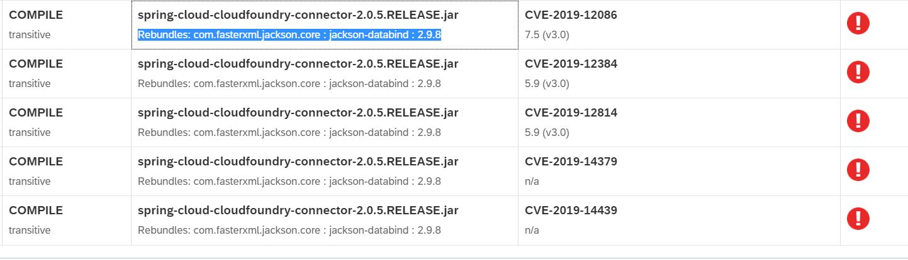

!!! warning
    This page provides answers and solutions to frequent questions and problems of @@PROJECT_NAME@@ end-users.
    Please review this material carefully **before** asking support, filing bug reports, or requesting new features.

    Only if you cannot find an answer to your questions in this page, please see the [help](../) to learn
    how to get support.

**LIST OF QUESTIONS**

[TOC]

## General questions

### Why can't I compile my Maven project anymore after I activate the @@PROJECT_NAME@@ profile?

You may want to check whether there are other `<profile>` sections that declare dependencies. If so, one of those is probably activated by default. In this case, when using the @@PROJECT_NAME@@ profile, those other profiles will not be active, hence, there are dependencies missing, which can lead to compile exceptions. To fix, you should activate multiple profiles at once using the `-P` option, see [here](https://maven.apache.org/guides/introduction/introduction-to-profiles.html) for more information.

### Why does @@PROJECT_NAME@@ backend refuse HTTP connections established by @@PROJECT_NAME@@ Maven plugin?

The @@PROJECT_NAME@@ plugins gathers very detailed information about all Java archives required by an application. For example, it collects the method signatures of all methods contained in every JAR. For every archive, identified by its SHA1, this information must be uploaded to and stored by the @@PROJECT_NAME@@ backend in case it is not yet known. This requirement will cause a lot of uploads when an application is first analyzed, because a lot of dependencies may not be known.

Problem: As a result of the above, it can happen that _**several**_ HTTP POST connection requests are refused by the @@PROJECT_NAME@@ backend during the @@PROJECT_NAME@@ Maven plugin execution, which will result in error messages as follows.

`Copy&paste from console`

**Solution**

- @@PROJECT_NAME@@ plugin users can simply re-run the @@PROJECT_NAME@@ goal "app" multiple times up until the information for all archives has been uploaded. With each run, more and more archives will be successfully uploaded, up until a point where every archive is known. According to our experience, this is the case after a few runs only (`<5`).

### Why do all HTTP connections fail from the @@PROJECT_NAME@@ Maven plugin?

**Problem**

Not a single HTTP connection can be established, which becomes obvious if even the first connection request hangs for several minutes and eventually fails as follows:

```text
[INFO] ------------------------------------------------------------------------
[INFO] Building com.at.example.spring-01 0.0.1-SNAPSHOT
[INFO] ------------------------------------------------------------------------
[INFO]
[INFO] --- maven-clean-plugin:2.5:clean (default-clean) @ com.at.example.spring-01 ---
[INFO] Deleting C:\My Documents\com.at.example.spring-01\target
[INFO]
[INFO] --- maven-dependency-plugin:2.10:copy (copy-vulas) @ com.at.example.spring-01 ---
[INFO] Configured Artifact: com.sap.research.security.vulas:vulas-core:jar-with-dependencies:1.1.0-SNAPSHOT:jar
[INFO] Configured Artifact: com.sap.research.security.vulas:vulas-core:jar-with-dependencies:1.1.0-SNAPSHOT:jar
[INFO] Copying vulas-core-1.1.0-SNAPSHOT-jar-with-dependencies.jar to C:\My Documents\com.at.example.spring-01\target\vulas\lib\vulas-core-1.1.0-SNAPSHOT-jar-with-dependencies.jar
[INFO] Copying vulas-core-1.1.0-SNAPSHOT-jar-with-dependencies.jar to C:\My Documents\com.at.example.spring-01\target\vulas\include\vulas-core-1.1.0-SNAPSHOT-jar-with-dependencies.jar
[INFO]
[INFO] --- vulas-maven-plugin:1.1.0-SNAPSHOT:clean (vulas-clean) @ com.at.example.spring-01 ---
[main] INFO com.sap.psr.vulas.GoalExecution - @@PROJECT_NAME@@ goal execution started [id=CLEAN-1448374577441-14554386, goal=CLEAN, app=(com.at.example:com.at.example.spring-01:jar:0.0.1-SNAPSHOT)]
[main] INFO com.sap.psr.vulas.backend.Collector - HTTP request started [url=, user=]
[vulas-memo] INFO com.sap.psr.vulas.GoalExecution - Memory consumption (used/avg): [57.75 MB/57.75 MB], JVM (free/total/max): [183.75 MB/241.50 MB/3559.50 MB]
[main] ERROR com.sap.psr.vulas.backend.Collector - HTTP request error while calling [], HTTP response written to [C:\Users\iXXXXXX\AppData\Local\Temp\vulas-tmp-8966348801119324800.html]
```

**Solution**

Run the @@PROJECT_NAME@@ Maven plugin with a different proxy than the default proxy specified in the configuration (`@@PROXY_HOST@@`). You need to change 2 settings:

On the command line, run Maven as follows, whereby `<proxy>` can be `@@CUSTOM_PROXY_HOST@@` or simply `proxy`

```sh
mvn -Dhttp.proxyHost=<proxy> -Dvulas vulas:app
```

In the Maven Surefire plugin, include the `-Dhttp.proxyHost` system property for the JVM spawned for JUnit tests:

```xml
<plugin>
<groupId>org.apache.maven.plugins</groupId>
<artifactId>maven-surefire-plugin</artifactId>
<version>2.14</version>
<configuration>
    <argLine>
    ...
    -Dhttp.proxyHost=@@CUSTOM_PROXY_HOST@@
    ...
    </argLine>
</configuration>
</plugin>
```

### Why does my workspace stay empty?

When executing a vulas goal, your workspace is not filled with the results of the scan. Instead of this your results are usually uploaded to the PUBLIC workspace of the @@PROJECT_NAME@@ Frontend.

- You first need to insure that you are using at least version 3.0 of @@PROJECT_NAME@@. The workspace feature was introduced with @@PROJECT_NAME@@ 3. By default, if you are running @@PROJECT_NAME@@ 2.x (and you should not!) all the data are stored in the "PUBLIC" workspace in the @@PROJECT_NAME@@ Frontend. Please notice that the @@PROJECT_NAME@@ plugin name was changed with @@PROJECT_NAME@@ 3: it was changed from `vulas-maven-plugin` to `plugin-maven` (click [here](../../tutorials/java_maven/#setup) for more details). It is quite usual that developers working with Jenkins/Piper are pointing to an old version of @@PROJECT_NAME@@ (2.x) because their Jenkins/Piper platform itself points to the old @@PROJECT_NAME@@ plugin name. A simple update there usually solves the issue.
- You need to insure that you have correctly indicated to @@PROJECT_NAME@@ where to upload the results of your scans (e.g. in your workspace). Please click [here](../../manuals/setup/#workspace) and [here](../../manuals/setup/#configuration) for details about workspaces and how to use them.

### What is the cause of the following `ERROR: vulas-maven-plugin:3.x.x or one of its dependencies could not be resolved`?

You are running the execution of a maven goal and are facing an error similar to the following one:

```text
[ERROR] Plugin com.sap.research.security.vulas:vulas-maven-plugin:3.0.8 or one of its dependencies could not be resolved: Could not find artifact com.sap.research.security.vulas:vulas-maven-plugin:jar:3.0.8 in mirror1 (url) -> [Help 1]
```

You most probably updated your settings to use Maven 3.x instead of Maven 2.x. The @@PROJECT_NAME@@ plugin was renamed with @@PROJECT_NAME@@ 3.x: it was changed from `vulas-maven-plugin` to `plugin-maven`. You may need to update your settings accordingly (click [here](../../tutorials/java_maven/#setup) for more details on how to update your settings).

### Why do I get the following message: `WARN: App does not exist in backend, goal upload skipped`?

**Symptom**: The console contains a log message as follows:

```log
WARN com.sap.psr.vulas.backend.BackendConnector - App [group=com.acme, artifact=parent, version=1-SNAPSHOT, packaging=pom] does not exist in backend, goal upload skipped
```

**Explanation**: Information related to the execution of a goal, e.g., execution time or memory consumption, cannot be uploaded as the respective application does not exist in the backend. This is not necessarily a problem, hence, the message is issued as warning. Examples where an application does not exist in the backend are as follows:

- If an application does neither have any dependencies nor source code, e.g., in folder `src/main/java`, it will not be uploaded to the backend (depending on configuration parameter `vulas.core.app.uploadEmpty`, which defaults to `false`). In this case, the execution of goal execution information cannot be uploaded. Typical examples of _empty_ applications are Maven aggregator projects (`<packaging>pom</packaging>`).
- If an application version is analyzed for the first time, the initial execution of the `clean` goal will also result in this warning message.

### Why does @@PROJECT_NAME@@ show vulnerabilities which seems to be related to others components

**Symptom**: In the @@PROJECT_NAME@@ FrontEnd or in the @@PROJECT_NAME@@ report, @@PROJECT_NAME@@ displays findings which seem to be related to others components:

**Example**:
In the following screenshot, user can see a list of CVEs related to "jackson-databind" which are associated to an archive related to the "spring" component by @@PROJECT_NAME@@. 



**Explanation**: @@PROJECT_NAME@@ has detected that the used archive embedds the code of the artifact associated to the CVE. The finding is correct.
In the previous example, the file "spring-cloud-cloudfoundry-connector-2.0.5.RELEASE.jar" contains the vulnerable code of "jackson-databind".


## Understanding the results produced by @@PROJECT_NAME@@

### @@PROJECT_NAME@@ reported vulnerabilities for which I found no data in NVD. What should I do about them?

For vulnerabilities that do not come from the NVD we do provide reference links. They are listed in the vulnerability details page accessible clicking on the different rows of the vulnerability main table (see example below).


### Why is @@PROJECT_NAME@@ is not detecting all vulnerabilities of my project?

- If the vulnerability is included in our knowledge base but it is not detected for your application, you can select the checkbox “Include historical vulnerabilities” in the @@PROJECT_NAME@@ frontend and hit “Reload” button: you will see all CVEs that applied to previous versions of your dependencies. The  indicates that a given CVE did apply to earlier versions, but you are currently using a non-vulnerable one.
- Despite our best efforts to keep the @@PROJECT_NAME@@ vulnerability knowledge base continuously updated, it is possible that a particular vulnerability is not yet covered. Query `/backend/bugs` to check if a vulnerability is covered or not.

## Method-level bill of material (goal app)

### app : NotFoundException when analyzing JAR files?

Problem: When analyzing JAR files, error messages similar to the following are printed:

```text
ERROR com.sap.psr.vulas.JarAnalyzer  - JarAnalyzer[jar/war=org.apache.servicemix.bundles.jaxb-xjc-2.2.4_1.jar, mavenId=(org.apache.servicemix.bundles:org.apache.servicemix.bundles.jaxb-xjc:2.2.4_1), instr=false, instrCtx=(com.acme:foo:pom:1.0-SNAPSHOT)]: NotFoundException while analyzing class [1.0.com.sun.xml.xsom.parser.JAXPParser]: 1.0.com.sun.xml.xsom.parser.JAXPParser
```

Explanation: This can be due to the use of Java identifiers that do not confirm with the [Java language specification](https://docs.oracle.com/javase/specs/jls/se7/html/jls-3.html#jls-3.8). In this example, the actual package name of "1.0.com.sun.xml.xsom.parser.JAXPParser", as seen in the JAR file, is "1.0". @@PROJECT_NAME@@, however, uses dots for separating package identifiers.

Note: As of Java 9, multi-release archives can contain class files in subdirectories. They are not yet supported by @@PROJECT_NAME@@.

Solution: Not yet known. For the time being, clarify who produced the respective JAR file.

### app : The goal execution takes very long

Problem: The execution of the APP goal takes very long.

Explanation: Whenever a JAR, identified by its SHA1, is unknown to the backend, all its method signatures are gathered and uploaded. As a result, the first execution(s) of `vulas:app` can take some time, as any yet unknown JAR need to be covered. Future executions will be significantly faster.

### app : The goal execution breaks with a 5xx response code received from the backend

Problem: The goal execution breaks with a 5xx response code received from the backend.

Explanation: This can happen if multiple processes (on the same computer or remotely) try to upload the same method signature to the backend. In such cases, one can simply restart at a later time to avoid the clash.

### app : The goal execution breaks with a java.nio.file.InvalidPathException

Problem: The goal execution breaks with a `java.nio.file.InvalidPathException: Malformed input or input contains unmappable characters` as viewable here below.

```text
[ERROR] Failed to execute goal com.sap.research.security.vulas:plugin-maven:@@PROJECT_VERSION@@:app (default-cli) on project xxxxx: java.nio.file.InvalidPathException: Malformed input or input contains unmappable characters: shapeless/$tilde$qmark$greater$?.class
```

Explanation : the exception  is often due to an encoding problem.

Solution : Try one of the following options.

1/ Add the property `<project.build.sourceEncoding>UTF-8</project.build.sourceEncoding>` to your pom.xml file. Current property `<encoding>` only works if added to the configuration section of individual plugins.

OR

2/ Force the usage of the UTF-8 encoding using the `"-Dsun.jnu.encoding=UTF-8 -Dfile.encoding=UTF-8"` properties in your command line.

## Reachability Analysis (goals a2c and t2c)

### a2c : java.lang.OutOfMemoryError

Solutions:

- Increase the maximum and minimum JVM heap space with `-Xmx` and `-Xms`.
- Prior to Java8, also add `-XX:MaxPermSize=2g -XX:+CMSClassUnloadingEnabled`.

### a2c : Timeout during reachability analysis

Problem: The execution of the reachability analysis causes a timeout, e.g.,

```log
[main] WARN com.sap.psr.vulas.cg.ReachabilityAnalyzer - [vulas-reach-7] reached timeout and will be interrupted
[main] WARN com.sap.psr.vulas.cg.ReachabilityAnalyzer - com.ibm.wala.util.intset.BitVectorIntSet.<init>(BitVectorIntSet.java:45)
[main] WARN com.sap.psr.vulas.cg.ReachabilityAnalyzer - com.ibm.wala.util.intset.BitVectorIntSet.addAllOblivious(BitVectorIntSet.java:126)
[main] WARN com.sap.psr.vulas.cg.ReachabilityAnalyzer - com.ibm.wala.util.intset.MutableSharedBitVectorIntSet.makeDenseCopy(MutableSharedBitVectorIntSet.java:984)
[main] WARN com.sap.psr.vulas.cg.ReachabilityAnalyzer - com.ibm.wala.util.intset.MutableSharedBitVectorIntSet.addAll(MutableSharedBitVectorIntSet.java:752)
[main] WARN com.sap.psr.vulas.cg.ReachabilityAnalyzer - com.ibm.wala.util.intset.MutableSharedBitVectorIntSet.addAllInIntersectionInternal(MutableSharedBitVectorIntSet.java:1067)
[main] WARN com.sap.psr.vulas.cg.ReachabilityAnalyzer - com.ibm.wala.util.intset.MutableSharedBitVectorIntSet.addAllInIntersection(MutableSharedBitVectorIntSet.java:1032)
[main] WARN com.sap.psr.vulas.cg.ReachabilityAnalyzer - com.ibm.wala.fixpoint.IntSetVariable.addAllInIntersection(IntSetVariable.java:175)
[main] WARN com.sap.psr.vulas.cg.ReachabilityAnalyzer - com.ibm.wala.fixpoint.IntSetVariable.addAllInIntersection(IntSetVariable.java:158)
[main] WARN com.sap.psr.vulas.cg.ReachabilityAnalyzer - com.ibm.wala.ipa.callgraph.propagation.FilteredPointerKey$SingleClassFilter.addFiltered(FilteredPointerKey.java:65)
[main] WARN com.sap.psr.vulas.cg.ReachabilityAnalyzer - com.ibm.wala.ipa.callgraph.propagation.PropagationCallGraphBuilder$FilterOperator.evaluate(PropagationCallGraphBuilder.java:623)
[main] WARN com.sap.psr.vulas.cg.ReachabilityAnalyzer - com.ibm.wala.ipa.callgraph.propagation.PropagationCallGraphBuilder$FilterOperator.evaluate(PropagationCallGraphBuilder.java:1)
[main] WARN com.sap.psr.vulas.cg.ReachabilityAnalyzer - com.ibm.wala.fixpoint.UnaryStatement.evaluate(UnaryStatement.java:36)
[main] WARN com.sap.psr.vulas.cg.ReachabilityAnalyzer - com.ibm.wala.fixedpoint.impl.AbstractFixedPointSolver.solve(AbstractFixedPointSolver.java:150)
[main] WARN com.sap.psr.vulas.cg.ReachabilityAnalyzer - com.ibm.wala.ipa.callgraph.propagation.StandardSolver.solve(StandardSolver.java:40)
[main] WARN com.sap.psr.vulas.cg.ReachabilityAnalyzer - com.ibm.wala.ipa.callgraph.propagation.PropagationCallGraphBuilder.makeCallGraph(PropagationCallGraphBuilder.java:269)
[main] WARN com.sap.psr.vulas.cg.ReachabilityAnalyzer - com.sap.psr.vulas.cg.wala.WalaCallgraphConstructor.buildCallgraph(WalaCallgraphConstructor.java:308)
[main] WARN com.sap.psr.vulas.cg.ReachabilityAnalyzer - com.sap.psr.vulas.cg.ReachabilityAnalyzer.run(ReachabilityAnalyzer.java:265)
[main] WARN com.sap.psr.vulas.cg.ReachabilityAnalyzer - java.lang.Thread.run(Thread.java:745)
[main] ERROR com.sap.psr.vulas.cg.ReachabilityAnalyzer - [vulas-reach-7] terminated w/o success after [ 15,0 min]
```

Solution(s):

- Increase the timeout by changing the configuration setting `vulas.reach.timeout`, e.g., `mvn -Dvulas.reach.timeout=600 -Dvulas compile vulas:a2c`
- Decrease the precision of the call graph construction, e.g., by changing the system property `vulas.reach.wala.callgraph.reflection`. For instance, run the reachability analysis as follows: `mvn -Dvulas vulas:a2c -Dcallgraph.reflection=NONE`. See [manual/analysis#a2c](../../manuals/analysis/#reachable-from-app-a2c) for more configuration options.

### a2c : java.io.FileNotFoundException?

Problem: During `a2c`, a given JAR cannot be found by Wala, which produces an error message as following:

```text
Exception in thread "vulas-reach-1" com.ibm.wala.util.debug.UnimplementedError: java.io.FileNotFoundException: .\InfoView\dep\BOE\WEB-INF\eclipse\plugins\axis2\lib\jaxb-api.jar (The system cannot find the file specified)
```

Solution(s):

- Set the configuration parameter `vulas.reach.preprocessDependencies` to `true`

Explanation: The problem occurs if the MANIFEST file of a JAR refers to other dependencies using the `Class-Path` entry. Wala, for instance, will try to resolve those dependencies. The pre-processing will remove the corresponding manifest file entries.


### a2c : Invalid byte code in method?

Problem: During `a2c` or `t2c`, the call graph construction by Wala fails with an error message as follows:

```log
error: invalid byte code in method org.springframework.asm.ClassReader.readConst(I[C)Ljava/lang/Object;
Exception in thread "vulas-reach-1" com.ibm.wala.util.debug.UnimplementedError
    at com.ibm.wala.util.debug.Assertions.UNREACHABLE(Assertions.java:46)
    at com.ibm.wala.classLoader.ShrikeCTMethod.makeDecoder(ShrikeCTMethod.java:107)
```

Solution:  Append the respective package to the configuration setting `vulas.reach.wala.callgraph.exclusions`, which lists all the Java packages to be ignored by Wala. Note that dots (.) separating package names are replaced by slash (/).

Example: In case of the above error message, one has to add the string `org/springframework/asm/.*` in order to ignore all classes of package `asm`. The new value of the configuration setting looks as follows:

```ini
vulas.reach.wala.callgraph.exclusions = java/awt/.*;javax/swing/.*;sun/awt/.*;sun/swing/.*;org/netbeans/.*;com/sun/.*;org/openide/.*;com/ibm/crypto/.*;com/ibm/security/.*;org/apache/xerces/.*;org/springframework/asm/.*
```

## Instrumentation and trace collection (goals test and instr)

### TEST : java.lang.NoSuchMethodError?

Problem: The execution of the test phase throws a NoSuchMethodError exception. This can happen if an application makes use (directly or transitively) of an older release of a library that is also required by @@PROJECT_NAME@@. In the below example, an application used commons-collections v3.0.0, while @@PROJECT_NAME@@ needs commons-collections v3.2.2 (whose classes are actually included in the vulas-with-dependencies.jar).

```log
-------------------------------------------------------
T E S T S
-------------------------------------------------------
java.lang.reflect.InvocationTargetException
at sun.reflect.NativeMethodAccessorImpl.invoke0(Native Method)
at sun.reflect.NativeMethodAccessorImpl.invoke(NativeMethodAccessorImpl.java:62)
at sun.reflect.DelegatingMethodAccessorImpl.invoke(DelegatingMethodAccessorImpl.java:43)
at java.lang.reflect.Method.invoke(Method.java:497)
at sun.instrument.InstrumentationImpl.loadClassAndStartAgent(InstrumentationImpl.java:386)
at sun.instrument.InstrumentationImpl.loadClassAndCallPremain(InstrumentationImpl.java:401)
Caused by: java.lang.NoSuchMethodError: org.apache.commons.collections.CollectionUtils.isEmpty(Ljava/util/Collection;)Z
at org.apache.commons.configuration.XMLConfiguration.constructHierarchy(XMLConfiguration.java:640)
at org.apache.commons.configuration.XMLConfiguration.initProperties(XMLConfiguration.java:596)
at org.apache.commons.configuration.XMLConfiguration.load(XMLConfiguration.java:1009)
at org.apache.commons.configuration.XMLConfiguration.load(XMLConfiguration.java:972)
at org.apache.commons.configuration.XMLConfiguration$XMLFileConfigurationDelegate.load(XMLConfiguration.java:1647)
at org.apache.commons.configuration.AbstractFileConfiguration.load(AbstractFileConfiguration.java:324)
at org.apache.commons.configuration.AbstractFileConfiguration.load(AbstractFileConfiguration.java:261)
at org.apache.commons.configuration.AbstractFileConfiguration.load(AbstractFileConfiguration.java:238)
at org.apache.commons.configuration.AbstractHierarchicalFileConfiguration.load(AbstractHierarchicalFileConfiguration.java:184)
at org.apache.commons.configuration.DefaultConfigurationBuilder.getConfiguration(DefaultConfigurationBuilder.java:608)
at org.apache.commons.configuration.DefaultConfigurationBuilder.getConfiguration(DefaultConfigurationBuilder.java:587)
at com.sap.psr.vulas.monitor.DynamicTransformer.<init>(DynamicTransformer.java:81)
at com.sap.psr.vulas.monitor.DynamicTransformer.getInstance(DynamicTransformer.java:304)
at com.sap.psr.vulas.monitor.DynamicTransformer.premain(DynamicTransformer.java:320)
... 6 more
FATAL ERROR in native method: processing of -javaagent failed
Exception in thread "main"
```

Solution: Change the dependency of your application to a more recent release. In the above example, the following XML snippet was added to the application's POM (which transitively depended on it):

```xml
<dependency>
    <groupId>commons-collections</groupId>
    <artifactId>commons-collections</artifactId>
    <version>3.2.2</version>
</dependency>
```

### TEST : Not all @@PROJECT_NAME@@ analysis results are uploaded to the backend

Problem: At the end of the JUnit test case execution (`mvn -Dvulas test`), not all the @@PROJECT_NAME@@ analysis results are uploaded to the the @@PROJECT_NAME@@ backend. The reason is that the Maven Surefire Plugin kills the JVM before @@PROJECT_NAME@@' shutdown hook uploaded all the data.

Solution: Disable the upload by changing the Surefire configuration in the POM file as follows. The analysis results will then be written in the folder `target/vulas/upload`. Afterwards, run the @@PROJECT_NAME@@ plugin goal "upload" in order to upload the JSON analysis results to the backend (`mvn -Dvulas vulas:upload`).

```xml
<argLine>
    -Dvulas.upload=false
```

### TEST : How to run `-Dvulas test` in projects using Mockito?

**Problem**: when running  `mvn -Dvulas test`, tests fail with an error such as `org.mockito.exceptions.misusing.MissingMethodInvocationException`

**Solution**:

- Run your tests as usual:
    ```sh
    mvn test
    ```
- Then run them again with @@PROJECT_NAME@@ enabled to perform reachability analysis:
    ```sh
    mvn -Dmaven.test.failure.ignore=true -Dvulas test vulas:upload
    ```

**Alternative solutions (when running `mvn -Dvulas test`)**:

- disable selectively the failing tests
- ignore selected jars

### TEST : Byte code instrumentation fails

**Problem**

No  traces are collected during the execution of JUnit tests, no matter which instrumentor is used. Moreover, no corresponding error messages or exceptions are printed to the console. A possible indicator of that problem is the appearance of the log message "Completed instantiation of trace collector" _**after**_ the log message "Tests run: XXX, Failures: XXX, Errors: XXX, Skipped: XXX, Time elapsed: XXX sec", which signals the termination of the actual JUnit tests.

Example:

```text
[main] INFO  com.sap.psr.vulas.monitor.InstrumentationControl  - JAR [C:\Users\XXXXXX\.m2\repository\org\apache\commons\commons-lang3\3.2\commons-lang3-3.2.jar] is blacklisted: [false]
Tests run: 2, Failures: 0, Errors: 0, Skipped: 0, Time elapsed: 0.141 sec - in code.MainTest
[vulas-shutdown-trace-upload] INFO  com.sap.psr.vulas.backend.requests.BasicHttpRequest  - HTTP GET [uri=@@ADDRESS@@/backend/apps/XXXXXX/XXXXXX/XXXXXX/bugs?historical=false, proxy=false]
[vulas-shutdown-trace-upload] INFO  com.sap.psr.vulas.backend.requests.BasicHttpRequest  - HTTP GET completed with response code [200] in [0,0573 min]
[vulas-shutdown-trace-upload] INFO  com.sap.psr.vulas.backend.BackendConnector  - [53] constructs for [7] bugs received from backend
[vulas-shutdown-trace-upload] INFO  com.sap.psr.vulas.monitor.trace.TraceCollector  - Completed instantiation of trace collector
[vulas-shutdown-trace-upload] INFO  com.sap.psr.vulas.monitor.trace.TraceCollector  - No paths collected
[vulas-shutdown-trace-upload] INFO  com.sap.psr.vulas.monitor.trace.TraceCollector  - No traces collected
[vulas-shutdown-trace-upload] INFO  com.sap.psr.vulas.GoalExecution  - @@PROJECT_NAME@@ goal execution finished [id=TEST-1487175325075-7552264, goal=TEST, app=(XXXXXX:XXXXXX:XXXXXX)] in [0,0877 min]
```

**Solution**

Similar to the above problem, it can happen that an application depends on a previous release of Javassist. As such, methods required by @@PROJECT_NAME@@ are not present at the time @@PROJECT_NAME@@ tries to change the byte code of loaded classes. As for the previous problem, you can add an explicit dependency to the application under test in order to let Maven resolve to a recent release of Javassist.

### TEST : The forked VM terminated

Problem: Tests terminate with a log message as follows: `The forked VM terminated without properly saying goodbye. VM crash or System.exit called?`

Solutions:

- Increase JVM heap space by adding `-Xmx4096M -Xms2048M` (or more if possible) to the `<argLine>` argument of the Maven Surefire plugin
- Select an instrumentor that consumes less memory by adding, for instance, `-Dvulas.core.instr.instrumentorsChoosen=com.sap.psr.vulas.monitor.trace.SingleTraceInstrumentor`.

### TEST : Incomplete app context

**Problem**

Tests terminate with the error message `App context incomplete: [group=, artifact=, version=]` and there exists a white space in any of the parent directories of the Maven project (e.g., `C:\My Documents\projects\foo`).

**Solutions**

- Move the Maven project to a location without whitespaces in the names of any of the parent directories.
- Open the `pom.xml` and replace the Maven variable `${project.build.directory}` in the `<argLine>` configuration setting of the `maven-surefire-plugi`n by the relative path of the respective directory, typically `target`.
- Open the POM file and remove the `-Dvulas.core.uploadDir` and `-Dvulas.shared.tmpDir` system properties in the `<argLine>` configuration setting of the `maven-surefire-plugin`. Create two new system property variables in the configuration section of the `maven-surefire-plugin` as follows (see here for more information).

```xml
<systemPropertyVariables>
  <vulas.core.uploadDir>${project.build.directory}/vulas/upload</vulas.core.uploadDir>
  <vulas.shared.tmpDir>${project.build.directory}/vulas/tmp</vulas.shared.tmpDir>
</systemPropertyVariables>
```

### TEST : "Error injecting: private org.eclipse.aether.spi.log.Logger org.apache.maven.repository.internal.DefaultVersionResolver.logger"

**Problem**

When running the @@PROJECT_NAME@@ test goal, you face an error similar to `Error injecting: private org.eclipse.aether.spi.log.Logger org.apache.maven.repository.internal.DefaultVersionResolver.logger`

**Solution**

This error seems to appear with certain versions of Maven. It should disappear with maven 3.5.2 or higher. Please insure which version of maven you are using.

- If you locally run maven on your machine, please upgrade your local maven version to maven 3.5.2 or higher and run your scan again.
- If you perform your scans in a CI/CD environment like Jenkins, please check which version of Maven is used there. Then validate that the issue is linked to the current maven version (see previous point). Once you validated that the current Maven version is responsible for the issue, proceed with the update/upgrade to Maven 3.5.2 or higher in your CI/CD environment.

As an example in Jenkins environments you can use one of the following alternatives:

- Make an upgrade request to your Jenkins administrator.
- Install Maven "globaly": in this case you can continue using your former command ex: `mvn clean compile vulas:clean vulas:app install vulas:upload -Pvulas -Dskip.integration.tests` as it is and Jenkins will use the new version.
- Install maven as new "Global Tool": you can do this in "Manage Jenkins" -> "Global Tool Configuration". Here you find the entry "Maven installations". Add there the new Maven installation "M360" (if you like to install maven 3.6.0) with the installer "Install from Apache" Version 3.6.0. As a consequence, you will need to change the command in your job/task so that the new Maven version is used instead of the global one (which is still the version including the bug) and your command should like like `/var/jenkins_home/tools/hudson.tasks.Maven_MavenInstallation/M360/bin/mvn clean compile vulas:clean vulas:app install vulas:upload -Pvulas -Dskip.integration.tests`

### JUnit tests using Powermock fail when using @@PROJECT_NAME@@

**Problem**

JUnit tests making use of Powermock fail when activating the @@PROJECT_NAME@@ profile.

**Explanation**

In order to collect execution traces during test execution, the @@PROJECT_NAME@@ agent has to be registered at the JVM. This is done in the configuration section of the surefire plugin inside the @@PROJECT_NAME@@ profile. The parallel use of Powermock and the @@PROJECT_NAME@@ agent, which modifies all the bytecode of every class loaded by the JVM, fails in certain cases.

**Solution(s)**

This problem can be solved in several ways:

- Ignore all test failures by adding `-Dmaven.test.failure.ignore=true` (also see [other options](https://maven.apache.org/surefire/maven-surefire-plugin/test-mojo.html) of the `maven-surefire-plugin`)
- In case of multi-module projects, continue the build of later modules using the options `--fail-never` or `--fail-at-end` (see [here](https://books.sonatype.com/mvnref-book/reference/running-sect-options.html) for more information)
- Exclude problematic classes from being instrumented by adding their prefixes via `-Dvulas.core.instr.blacklist.classes.custom=foo.bar,bar.baz.Class,...`
- Exclude single problematic tests by modifying the `<excludes>` section of the surefire configuration in the @@PROJECT_NAME@@ profile:

```xml
<excludes>
    <exclude>**/doesnotexist.java</exclude>
</excludes>
```

## Python

### `app` goal is slow

Dependencies are analyzed by setting up a virtual environment for the respective application. The setup of such a virtualenv can take some time (no matter whether it is done in the context of @@PROJECT_NAME@@ or not). Moreover, whenever a Python library is found that is not yet known to the backend, its bill of material needs to be uploaded. The delay caused by this initial upload will not occur for subsequent scans.

### `virtualenv` problems

Run `virtualenv` from the command line to see whether it is properly installed and working.

## Other topics

### report: The HTML result report is not properly rendered inside Jenkins

**Symptom**: The HTML report is not properly rendered inside Jenkins (e.g., no images, no color-coding, no JavaScript, see the example screenshot below).


**Solution**: Either (a) download a ZIP of the @@PROJECT_NAME@@ report (the link can be found in the upper-right corner), or (b) adjust the content security policy (CSP) of Jenkins as described [here](https://wiki.jenkins.io/display/JENKINS/Configuring+Content+Security+Policy). In the latter case, you should execute the following command in the Jenkins script console (on a **single line**):

```java
System.setProperty("hudson.model.DirectoryBrowserSupport.CSP",
    "sandbox allow-scripts; default-src 'none'; img-src 'self' data:; style-src 'self' 'unsafe-inline'; script-src 'unsafe-inline'")
```

### No log messages of the @@PROJECT_NAME@@ Maven plugin appear on the console. Why?

**Symptom**

@@PROJECT_NAME@@ log messages are not printed to the console (e.g., during the execution of the Maven lifecycle phase "test"). Instead, the following error message is printed.

`ERROR StatusLogger No log4j2 configuration file found. Using default configuration: logging only errors to the console.`

**Explanation**

The @@PROJECT_NAME@@ Maven plugin makes use of log4j version 1, a corresponding configuration file is included in its JAR file. If, however, the project under analysis makes use of log4j version 2, but does not have a `log4j2.xml` file in folder `src/main/resources`, no log message of @@PROJECT_NAME@@ but the above error message is printed. Still, the traces are actually collected and uploaded to the central engine.

**Solution**

Create a file `src/main/resources/log4j2.xml` with the following sample content (copied from [here](https://logging.apache.org/log4j/2.0/manual/migration.html)) and adapt as needed.

```xml
<?xml version="1.0" encoding="UTF-8"?>
<Configuration>
    <Appenders>
        <Console name="STDOUT" target="SYSTEM_OUT">
        <PatternLayout pattern="%d %-5p [%t] %C{2} (%F:%L) - %m%n"/>
        </Console>
    </Appenders>
    <Loggers>
        <Logger name="org.apache.log4j.xml" level="info"/>
        <Root level="info">
        <AppenderRef ref="STDOUT"/>
        </Root>
    </Loggers>
</Configuration>
```

### OutOfMemoryError: GC overhead limit exceeded?

Use the command line options `-Xms` and `-Xmx` to adjust the heap memory available to the JVM. Chose a value for `-Xmx` that is close to your machine's physical memory. In case of Maven, use the statement `export MAVEN_OPTS="-Xms4g -Xmx8g"`. For versions before Java 8, you should also add the options `-XX:MaxPermSize=2024M -XX:+CMSClassUnloadingEnabled`.

Notes:

- See [here](http://www.oracle.com/technetwork/java/hotspotfaq-138619.html#gc_heap_32bit) for problems related to the heap space allocations on 32bit Java versions
- See [here](https://docs.oracle.com/cd/E13150_01/jrockit_jvm/jrockit/geninfo/diagnos/memman.html) for background information on Java memory management

### I get an error saying `VerifyError: Inconsistent stackmap frames at branch target`. What should I do?

If the execution of the Maven Surefire Plugin during the Maven lifecycle phase test fails with a `java.lang.VerifyError` similar to the following:

```log
[ERROR] Failed to execute goal org.apache.maven.plugins:maven-surefire-plugin:2.16:test (default-test) on project foo-bar: Execution default-test of goal org.apache.maven.plugins:maven-surefire-plugin:2.16:test failed: There was an error in the forked process
[ERROR] java.lang.VerifyError: Inconsistent stackmap frames at branch target 54
[ERROR] Exception Details:
[ERROR] Location:
[ERROR] com/acme/FooTest.<init>()V @54: aconst_null
[ERROR] Reason:
[ERROR] Type uninitializedThis (current frame, locals[0]) is not assignable to 'com/acme/FooTest' (stack map, locals[0])
[ERROR] Current Frame:
[ERROR] bci: @16
[ERROR] flags: { flagThisUninit }
[ERROR] locals: { uninitializedThis, null, 'java/lang/ClassLoader' }
[ERROR] stack: { 'java/lang/ClassLoader', null }
[ERROR] Stackmap Frame:
[ERROR] bci: @54
[ERROR] flags: { }
[ERROR] locals: { 'com/acme/FooTest', 'java/net/URL', 'java/lang/ClassLoader' }
[ERROR] stack: { }
[ERROR] Bytecode:
[ERROR] 0000000: b200 bd9a 0047 014c 1235 b600 914d 2c01
[ERROR] 0000010: a500 262c bb00 9359 b700 9412 35b6 0098
[ERROR] 0000020: 102e 102f b600 9cb6 00a0 12a2 b600 a0b6
[ERROR] 0000030: 00a5 b600 ab4c 014e 12bf 2c2b 0101 0101
[ERROR] 0000040: 2d03 0304 b800 c2b3 00bd 2ab7 0001 b800
[ERROR] 0000050: 022a b600 0312 04b6 0005 4c2a 2bb8 0006
[ERROR] 0000060: b500 07b1
[ERROR] Stackmap Table:
[ERROR] full_frame(@54,{Object[#53],Object[#181],Object[#167]},{})
[ERROR] full_frame(@74,{UninitializedThis},{})
[ERROR]
[ERROR] at java.lang.Class.getDeclaredMethods0(Native Method)
```

then you should include the Java option `noverify` in the Surefire configuration as follows:

```xml
<argLine>
    -javaagent:target/vulas/lib/vulas-core-${vulas.version}-jar-with-dependencies.jar
    -DperiodicUpload.enabled=false
    -DappContext.fixed.groupId=${project.groupId}
    -DappContext.fixed.artifactId=${project.artifactId}
    -DappContext.fixed.version=${project.version}
    -noverify
    <!-- Uncomment to debug the test execution or the @@PROJECT_NAME@@ plugin -->
    <!-- -Xrunjdwp:transport=dt_socket,server=y,suspend=y,address=8000 -->
</argLine>
```

See here for more information on the `noverify` option:

- [Stackoverflow](http://stackoverflow.com/questions/300639/use-of-noverify-when-launching-java-apps)
- [Chrononsystems](http://chrononsystems.com/blog/java-7-design-flaw-leads-to-huge-backward-step-for-the-jvm)
- [Informit](http://www.informit.com/articles/article.aspx?p=1187967&seqNum=2)
