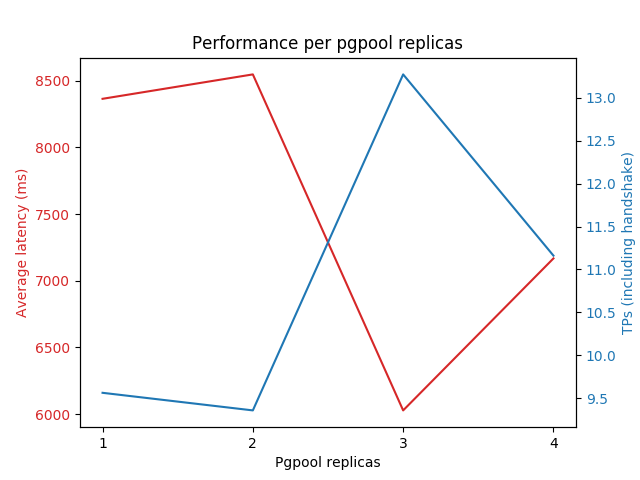

# Database Cluster benchmark

Pgbench run as a Kubernetes scheduled job within the cluster (on a distinct node from databases) with the following specs:
-   Scaling factor: 1
-   Query mode: simple (restricted here to Read queries)
-   Number of clients: 80
-   Number of threads: 8

This benchmark is performed with a Kubernetes cluster hosted on SAP Converge Cloud (based on Openstack) with three machines:
-   1 x 24560MB RAM, 24 VCPU, 64GB disk hosting the master database
-   2 x 16368MB RAM, 16 VCPU, 64GB disk hosting the slave database

Each of these have a mounted PVC (provisioned by Openstack Cinder) with a storage capacity of 400GB.

**Test cases:**  
All the below test cases execute a ready only sql script (see <a href="#script">below</a>) meant to globally simulate real life usages tested against a dataset of around 300gb and can be launched as a job (see in [benchmarking folder](../vulnerability-assessment-tool-core/templates/benchmark/README.md)).

-   Master direct: pgbench runs directly against the master node with `nclients` concurrent clients. This would represent the 'old' setup but with replication added on which would slightly tax performance.
-   Slave direct: pgbench runs directly against the slave service (with two exact endpoints). This would be the most optimal situation since pgbench clients can query both databases and thus reduce the response time on both. (Purely hypothethical as test cases only touch read-only queries)
-   Single pgpool instance: pgbench runs against pgpool connected to one master node and to slaves.
-   Multiple pgpool instances (3): pgbench runs against pgpool-service connected to 3 pgpool non clustered instance.

|                | Average  Latency(ms) | tps(with handshake) | tps(w/ handshake) |  Q0   |  Q1   |   Q2   |   Q3    |   Q4   |    Q5    |   Q6   |  Q7   |  Q8   |  Q9   |  Q10  |  Q11   |  Q12  |  Q13   |  Q14  |    Q15    |  Q16   |  Q17  |
|:--------------:|:--------------------:|:-------------------:|:-----------------:|:-----:|:-----:|:------:|:-------:|:------:|:--------:|:------:|:-----:|:-----:|:-----:|:-----:|:------:|:-----:|:------:|:-----:|:---------:|:------:|:-----:|
| Master  Direct |       7448.431       |      10.740517      |     10.740645     | 2.326 | 1.624 | 8.176  | 536.314 | 7.345  | 3018.764 | 21.753 | 3.847 | 2.468 | 1.650 | 3.315 | 15.557 | 2.919 | 2.341  | 3.209 | 3781.280  | 10.604 | 4.490 |
| Slave  Direct  |       6655.745       |      12.019692      |     12.019790     | 1.180 | 0.992 | 5.526  | 411.687 | 6.348  | 2746.081 | 29.709 | 1.817 | 1.172 | 0.832 | 2.999 | 24.242 | 1.463 | 0.965  | 2.770 | 3388.693  | 8.212  | 3.042 |
| Single pgpool  |       8364.560       |       9.54162       |      9.56348      | 2.727 | 2.167 | 8.458  | 575.846 | 8.354  | 3432.151 | 23.134 | 4.465 | 2.896 | 2.157 | 4.203 | 16.413 | 3.166 | 2.508  | 3.945 | 4234.848  | 10.405 | 4.791 |
| Pgpool cluster(3) |       6027.996       |      13.271408      |     13.271679     | 6.569 | 6.529 | 14.449 | 637.22  | 10.497 | 2287.350 | 26.816 | 7.384 | 6.981 | 6.558 | 8.472 | 24.400 | 6.997 | 6.6027 | 8.339 | 2982.970 | 11.871 | 7.649 |

## Statistical view

**Average Latency**

|                | Average Latency difference from optimal setup :  slave direct (in ms) | Average Latency difference from optimal setup (% over slave direct) |
|:--------------:|:---------------------------------------------------------------------:|:-------------------------------------------------------------------:|
|  Slave Direct  |                                + 0.00                                 |                                 0%                                  |
| Master Direct  |                               + 792.686                               |                                11.9%                                |
|     Pgpool     |                              + 1708.815                               |                                25.7%                                |
| Pgpool cluster(3) |                              -6.27.74899                              |                               -9.43%                                |

**Tps (Transaction per seconds)**

|                | tps with handshake difference from optimal setup (tps) | tps with handshake  difference from optimal setup (ratio over slave direct) | tps w/o handshake difference from optimal setup (tps) | tps w/o handshake  difference from optimal setup (ratio over slave direct) |
|:--------------:|:------------------------------------------------------:|:---------------------------------------------------------------------------:|:-----------------------------------------------------:|:--------------------------------------------------------------------------:|
|  Slave Direct  |                         + 0.00                         |                                     0%                                      |                        + 0.00                         |                                     0%                                     |
| Master Direct  |                       - 1.279175                       |                                   - 10.6%                                   |                      - 1.279145                       |                                  - 10.6%                                   |
|     Pgpool     |                       - 2.478072                       |                                   - 20.6%                                   |                       - 2.45631                       |                                  - 20.4%                                   |
| Pgpool cluster(3) |                       + 1.251716                       |                                   + 10.4%                                   |                      + 1.2518890                      |                                  +10.42%                                   |

Clustering pgpool seem to increase postgres performance drastically observable when it comes to more complex transactions such as those in Q15 and Q5. This is possibly due to the inane 'loadbalancing' provided by both service layers (pgpool-service) as well as pgpool load balancing mechanism. This comes at an lower performance for simple requests as the constant shifting and handshakes required makes simple queries unviable (sometimes with 300% average latencies than other methods)


## In depth Analysis of Pgpool clustering performance


With our current setup (1 master and 2 replicas with pgpool instance each having affinity towards sharing nodes with postgres instances), 3 replicas seems to be the optimal setup to reduce both latency and increase tps.


## Script
<a id='script'></a>
```sql
BEGIN;
select tenant0_.id as id1_27_, tenant0_.created_at as created_2_27_, tenant0_.is_default as is_defau3_27_, tenant0_.last_modified as last_mod4_27_, tenant0_.tenant_name as tenant_n5_27_, tenant0_.tenant_token as tenant_t6_27_ from tenant tenant0_ where tenant0_.is_default=true ;

select spaces0_.tenant as tenant11_24_0_, spaces0_.id as id1_24_0_, spaces0_.id as id1_24_1_, spaces0_.bug_filter as bug_filt2_24_1_, spaces0_.created_at as created_3_24_1_, spaces0_.export_configuration as export_c4_24_1_, spaces0_.is_default as is_defau5_24_1_, spaces0_.is_public as is_publi6_24_1_, spaces0_.last_modified as last_mod7_24_1_, spaces0_.space_description as space_de8_24_1_, spaces0_.space_name as space_na9_24_1_, spaces0_.space_token as space_t10_24_1_, spaces0_.tenant as tenant11_24_1_ from space spaces0_ where spaces0_.tenant='319624120';

select distinct a.id, a.artifact, a.created_at, a.modified_at, a.last_vuln_change, a.last_scan, a.mvn_group, a.space, a.version from app a inner join space s on a.space=s.id where s.space_token= 'A5344E8A6D26617C92A0CAD02F10C89C' and (extract(epoch from last_vuln_change) > 0 OR extract(epoch from last_scan) > 0) ;

select applicatio0_.id as id1_0_0_, space1_.id as id1_24_1_, applicatio0_.artifact as artifact2_0_0_, applicatio0_.created_at as created_3_0_0_, applicatio0_.last_scan as last_sca4_0_0_, applicatio0_.last_vuln_change as last_vul5_0_0_, applicatio0_.modified_at as modified6_0_0_, applicatio0_.mvn_group as mvn_grou7_0_0_, applicatio0_.space as space9_0_0_, applicatio0_.version as version8_0_0_, space1_.bug_filter as bug_filt2_24_1_, space1_.created_at as created_3_24_1_, space1_.export_configuration as export_c4_24_1_, space1_.is_default as is_defau5_24_1_, space1_.is_public as is_publi6_24_1_, space1_.last_modified as last_mod7_24_1_, space1_.space_description as space_de8_24_1_, space1_.space_name as space_na9_24_1_, space1_.space_token as space_t10_24_1_, space1_.tenant as tenant11_24_1_ from app applicatio0_ inner join space space1_ on applicatio0_.space=space1_.id where applicatio0_.mvn_group='com.acme' and applicatio0_.artifact='vulas-testapp-webapp' and applicatio0_.version='2.5.2-MVN' and applicatio0_.space='319624121' ;

 select dependenci0_.app as app10_2_0_, dependenci0_.id as id1_2_0_, dependenci0_.id as id1_2_1_, dependenci0_.app as app10_2_1_, dependenci0_.declared as declared2_2_1_, dependenci0_.filename as filename3_2_1_, dependenci0_.lib as lib11_2_1_, dependenci0_.origin as origin4_2_1_, dependenci0_.parent as parent12_2_1_, dependenci0_.path as path5_2_1_, dependenci0_.relative_path as relative6_2_1_, dependenci0_.scope as scope7_2_1_, dependenci0_.traced as traced8_2_1_, dependenci0_.transitive as transiti9_2_1_, library1_.id as id1_19_2_, library1_.created_at as created_2_19_2_, library1_.digest as digest3_19_2_, library1_.digest_algorithm as digest_a4_19_2_, library1_.digest_verification_url as digest_v5_19_2_, library1_.library_id_id as library_8_19_2_, library1_.modified_at as modified6_19_2_, library1_.wellknown_digest as wellknow7_19_2_, libraryid2_.id as id1_22_3_, libraryid2_.artifact as artifact2_22_3_, libraryid2_.mvn_group as mvn_grou3_22_3_, libraryid2_.version as version4_22_3_ from app_dependency dependenci0_ inner join lib library1_ on dependenci0_.lib=library1_.digest left outer join library_id libraryid2_ on library1_.library_id_id=libraryid2_.id where dependenci0_.app='319633948';

 select constructs0_.application_id as applicat1_1_0_, constructs0_.constructs_id as construc2_1_0_, constructi1_.id as id1_18_1_, constructi1_.lang as lang2_18_1_, constructi1_.qname as qname3_18_1_, constructi1_.type as type4_18_1_ from app_constructs constructs0_ inner join construct_id constructi1_ on constructs0_.constructs_id=constructi1_.id where constructs0_.application_id='319633948';

select goalexecut0_.id as id1_5_, goalexecut0_.app as app12_5_, goalexecut0_.client_version as client_v2_5_, goalexecut0_.created_at as created_3_5_, goalexecut0_.exception as exceptio4_5_, goalexecut0_.execution_id as executio5_5_, goalexecut0_.goal as goal6_5_, goalexecut0_.mem_max as mem_max7_5_, goalexecut0_.mem_used_avg as mem_used8_5_, goalexecut0_.mem_used_max as mem_used9_5_, goalexecut0_.runtime_nano as runtime10_5_, goalexecut0_.started_at_client as started11_5_ from app_goal_exe goalexecut0_ where goalexecut0_.app='319633948' order by goalexecut0_.started_at_client DESC ;


select applicatio0_.id as id1_0_0_, space1_.id as id1_24_1_, applicatio0_.artifact as artifact2_0_0_, applicatio0_.created_at as created_3_0_0_, applicatio0_.last_scan as last_sca4_0_0_, applicatio0_.last_vuln_change as last_vul5_0_0_, applicatio0_.modified_at as modified6_0_0_, applicatio0_.mvn_group as mvn_grou7_0_0_, applicatio0_.space as space9_0_0_, applicatio0_.version as version8_0_0_, space1_.bug_filter as bug_filt2_24_1_, space1_.created_at as created_3_24_1_, space1_.export_configuration as export_c4_24_1_, space1_.is_default as is_defau5_24_1_, space1_.is_public as is_publi6_24_1_, space1_.last_modified as last_mod7_24_1_, space1_.space_description as space_de8_24_1_, space1_.space_name as space_na9_24_1_, space1_.space_token as space_t10_24_1_, space1_.tenant as tenant11_24_1_ from app applicatio0_ inner join space space1_ on applicatio0_.space=space1_.id where applicatio0_.mvn_group='com.acme' and applicatio0_.artifact='vulas-testapp-webapp' and applicatio0_.version='2.5.2-MVN' and applicatio0_.space='319624121' ;

SELECT id FROM app_goal_exe WHERE app = '319633948' AND goal = 'APP' ORDER BY started_at_client DESC LIMIT 1 ;

select goalexecut0_.id as id1_5_0_, goalexecut0_.app as app12_5_0_, goalexecut0_.client_version as client_v2_5_0_, goalexecut0_.created_at as created_3_5_0_, goalexecut0_.exception as exceptio4_5_0_, goalexecut0_.execution_id as executio5_5_0_, goalexecut0_.goal as goal6_5_0_, goalexecut0_.mem_max as mem_max7_5_0_, goalexecut0_.mem_used_avg as mem_used8_5_0_, goalexecut0_.mem_used_max as mem_used9_5_0_, goalexecut0_.runtime_nano as runtime10_5_0_, goalexecut0_.started_at_client as started11_5_0_, applicatio1_.id as id1_0_1_, applicatio1_.artifact as artifact2_0_1_, applicatio1_.created_at as created_3_0_1_, applicatio1_.last_scan as last_sca4_0_1_, applicatio1_.last_vuln_change as last_vul5_0_1_, applicatio1_.modified_at as modified6_0_1_, applicatio1_.mvn_group as mvn_grou7_0_1_, applicatio1_.space as space9_0_1_, applicatio1_.version as version8_0_1_, space2_.id as id1_24_2_, space2_.bug_filter as bug_filt2_24_2_, space2_.created_at as created_3_24_2_, space2_.export_configuration as export_c4_24_2_, space2_.is_default as is_defau5_24_2_, space2_.is_public as is_publi6_24_2_, space2_.last_modified as last_mod7_24_2_, space2_.space_description as space_de8_24_2_, space2_.space_name as space_na9_24_2_, space2_.space_token as space_t10_24_2_, space2_.tenant as tenant11_24_2_, properties3_.space_id as space_id1_25_3_, property4_.id as properti2_25_3_, property4_.id as id1_23_4_, property4_.name as name2_23_4_, property4_.property_value as property3_23_4_, property4_.source as source4_23_4_, property4_.value_sha1 as value_sh5_23_4_, spaceowner5_.space_id as space_id1_26_5_, spaceowner5_.space_owners as space_ow2_26_5_, tenant6_.id as id1_27_6_, tenant6_.created_at as created_2_27_6_, tenant6_.is_default as is_defau3_27_6_, tenant6_.last_modified as last_mod4_27_6_, tenant6_.tenant_name as tenant_n5_27_6_, tenant6_.tenant_token as tenant_t6_27_6_ from app_goal_exe goalexecut0_ inner join app applicatio1_ on goalexecut0_.app=applicatio1_.id inner join space space2_ on applicatio1_.space=space2_.id left outer join space_properties properties3_ on space2_.id=properties3_.space_id left outer join property property4_ on properties3_.properties_id=property4_.id left outer join space_owners spaceowner5_ on space2_.id=spaceowner5_.space_id inner join tenant tenant6_ on space2_.tenant=tenant6_.id where goalexecut0_.id='319767613';

select configurat0_.goal_execution_id as goal_exe1_6_0_, configurat0_.configuration_id as configur2_6_0_, property1_.id as id1_23_1_, property1_.name as name2_23_1_, property1_.property_value as property3_23_1_, property1_.source as source4_23_1_, property1_.value_sha1 as value_sh5_23_1_ from app_goal_exe_configuration configurat0_ inner join property property1_ on configurat0_.configuration_id=property1_.id where configurat0_.goal_execution_id='319767613';

select systeminfo0_.goal_execution_id as goal_exe1_7_0_, systeminfo0_.system_info_id as system_i2_7_0_, property1_.id as id1_23_1_, property1_.name as name2_23_1_, property1_.property_value as property3_23_1_, property1_.source as source4_23_1_, property1_.value_sha1 as value_sh5_23_1_ from app_goal_exe_system_info systeminfo0_ inner join property property1_ on systeminfo0_.system_info_id=property1_.id where systeminfo0_.goal_execution_id='319767613';

select statistics0_.goal_execution_id as goal_exe1_8_0_, statistics0_.statistics as statisti2_8_0_, statistics0_.statistics_key as statisti3_0_ from app_goal_exe_statistics statistics0_ where statistics0_.goal_execution_id='319767613' ;

select goalexecut0_.id as id1_5_0_, goalexecut0_.app as app12_5_0_, goalexecut0_.client_version as client_v2_5_0_, goalexecut0_.created_at as created_3_5_0_, goalexecut0_.exception as exceptio4_5_0_, goalexecut0_.execution_id as executio5_5_0_, goalexecut0_.goal as goal6_5_0_, goalexecut0_.mem_max as mem_max7_5_0_, goalexecut0_.mem_used_avg as mem_used8_5_0_, goalexecut0_.mem_used_max as mem_used9_5_0_, goalexecut0_.runtime_nano as runtime10_5_0_, goalexecut0_.started_at_client as started11_5_0_, applicatio1_.id as id1_0_1_, applicatio1_.artifact as artifact2_0_1_, applicatio1_.created_at as created_3_0_1_, applicatio1_.last_scan as last_sca4_0_1_, applicatio1_.last_vuln_change as last_vul5_0_1_, applicatio1_.modified_at as modified6_0_1_, applicatio1_.mvn_group as mvn_grou7_0_1_, applicatio1_.space as space9_0_1_, applicatio1_.version as version8_0_1_, space2_.id as id1_24_2_, space2_.bug_filter as bug_filt2_24_2_, space2_.created_at as created_3_24_2_, space2_.export_configuration as export_c4_24_2_, space2_.is_default as is_defau5_24_2_, space2_.is_public as is_publi6_24_2_, space2_.last_modified as last_mod7_24_2_, space2_.space_description as space_de8_24_2_, space2_.space_name as space_na9_24_2_, space2_.space_token as space_t10_24_2_, space2_.tenant as tenant11_24_2_, properties3_.space_id as space_id1_25_3_, property4_.id as properti2_25_3_, property4_.id as id1_23_4_, property4_.name as name2_23_4_, property4_.property_value as property3_23_4_, property4_.source as source4_23_4_, property4_.value_sha1 as value_sh5_23_4_, spaceowner5_.space_id as space_id1_26_5_, spaceowner5_.space_owners as space_ow2_26_5_, tenant6_.id as id1_27_6_, tenant6_.created_at as created_2_27_6_, tenant6_.is_default as is_defau3_27_6_, tenant6_.last_modified as last_mod4_27_6_, tenant6_.tenant_name as tenant_n5_27_6_, tenant6_.tenant_token as tenant_t6_27_6_ from app_goal_exe goalexecut0_ inner join app applicatio1_ on goalexecut0_.app=applicatio1_.id inner join space space2_ on applicatio1_.space=space2_.id left outer join space_properties properties3_ on space2_.id=properties3_.space_id left outer join property property4_ on properties3_.properties_id=property4_.id left outer join space_owners spaceowner5_ on space2_.id=spaceowner5_.space_id inner join tenant tenant6_ on space2_.tenant=tenant6_.id where goalexecut0_.id='319767613'	;

select distinct dependency0_.id as col_0_0_, bug5_.id as col_1_0_ from app_dependency dependency0_ inner join app applicatio1_ on dependency0_.app=applicatio1_.id inner join lib library2_ on dependency0_.lib=library2_.digest inner join lib_constructs constructs3_ on library2_.id=constructs3_.library_id inner join construct_id constructi4_ on constructs3_.constructs_id=constructi4_.id cross join bug bug5_ inner join bug_construct_change constructc6_ on bug5_.bug_id=constructc6_.bug where applicatio1_.mvn_group='com.acme' and applicatio1_.artifact='vulas-testapp-webapp' and applicatio1_.version='2.5.2-MVN' and applicatio1_.space='319624121'  and constructi4_.id=constructc6_.construct_id and (constructi4_.type<>'PACK' or not (exists (select 1 from bug_construct_change constructc7_ inner join construct_id constructi8_ on constructc7_.construct_id=constructi8_.id where constructc7_.bug=constructc6_.bug and constructi8_.type<>'PACK' and (constructi8_.qname not like '%test%') and (constructi8_.qname not like '%Test%') and constructc7_.construct_change_type<>'ADD'))) and (constructi4_.type<>'MODU' or constructi4_.qname<>'setup') ;

select a.affected from (select distinct bug_id,library_id,affected from bug_affected_library where source='MANUAL' and lib is null UNION select distinct al1.bug_id,al1.library_id,al1.affected from bug_affected_library as al1 where al1.lib is null and (al1.source='AST_EQUALITY' OR al1.source='MINOR_EQUALITY'OR al1.source='MAJOR_EQUALITY' OR al1.source='GREATER_RELEASE' OR al1.source='INTERSECTION' OR al1.source='PROPAGATE_MANUAL') and not exists (select 1 from bug_affected_library as al2 where al2.source='MANUAL' and al1.bug_id=al2.bug_id and al1.library_id=al2.library_id)) as a where a.bug_id='CVE-2014-3612' and a.library_id='236764304';
END;
```
